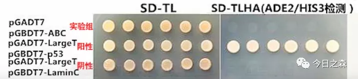

## 胡扯一通

从本科到研究生，从研究植物病原菌对主要杀菌剂的抗性风险和抗性机制，到基因功能验证。三四年过去了，对很多实验和原理都是一知半解。

本科两年多主要研究植物病原菌对主要杀菌剂的抗性风险和抗性机制。但直到现在还有很多问题我没有搞清楚（主要是没有专门去研究）。有时候想起来还是蛮遗憾。比如：
1.为什么在高浓度药剂选择压力下，就会出现抗药性菌株？某些作用类型的杀菌剂在某些位点的个别氨基酸的点突变对这些杀菌剂产生的高水平抗性到底是如何产生的？
2.对于新的药剂。在不知道作用位点的情况下如何设计实验，去确定该种新药剂的作用机制？
等等……

到研究生阶段，涉及的几个主要的实验无非就验证蛋白互作的几个实验：Yeast two-hybrid system；Bimolecular fluorescence complementation（BiFC）；Pull-down；Co-IP等。其他的比如各种PCR，转化等等。都知道一点，但都不熟知。这就很麻烦。
直到今天写这篇推文之前，我也只知道两个蛋白互作，则可在3缺或4缺培养基生长，若不互作，则不长。仅此而已。

## 进入正题

1989年，Fields等人的工作标志双杂交系统的正式建立[1]。

酵母双杂交技术最初由Fields等人在研究酵母转录因子GAL4性质时建立，后续经过不断改进已发展成为一种成熟的protein-protein互作研究技术，被广泛应用于互作蛋白的筛选、蛋白互作的鉴定和验证、蛋白互作机理的探究、蛋白连锁图谱绘制等工作。

Yeast two-hybrid system的建立是基于对真核生物调控转录起始过程的认识。酵母起始基因转录需要有反式转录激活因子的参与。反式转录激活因子，例如，GAL4包括两个彼此分离的但功能必需的结构域，分别是位于N端1-147位氨基酸残基区段的DNA结合域（DNA binding domain，DNA-BD）和位于C端768-881位氨基酸残基区段的转录激活域（Activation domain，AD)。DNA-BD能够识别位于GAL4效应基因（GAL4-responsivegene）的上游激活序列(Upstreamactivating sequence， UAS)，并与之结合。而AD则是通过与转录机构（transcription machinery）中的其他成分之间的结合作用，以启动UAS下游的基因进行转录。DNA-BD和AD单独分别作用并不能激活转录反应，但是当二者在空间上充分接近时，则呈现完整的GAL4转录因子活性并可激活UAS下游启动子，使启动子下游基因得到转录。

在酵母双杂交系统中，“诱饵”（bait）蛋白X构建至DNA-BD载体中，表达DNA-BD/X融合蛋白；“猎物”（prey）蛋白（待测试蛋白Y）构建至AD载体中，表达AD/Y融合蛋白。

如果bait和prey之间没有相互作用，BD和AD就不会与激活序列结合，报告基因也就不能被激活和表达；反之如果在酵母内，bait和prey相互作用且表达了，那么BD和AD就会与激活序列结合，下游报告基因（抗性筛选、蓝白斑筛选、营养缺陷型筛选等）也就被激活并进行表达。

故，bait和prey是否发生相互作用，即可通过对报告基因的激活表达与否进行检测。

https://commons.wikimedia.org/wiki/File:Two_hybrid_assay.svg

**AH109菌株：Trp和Leu缺陷型菌株，无法在缺少Trp和Leu的培养基中生长，因此可以用来进行转化筛选。**

这种改造后的酵母细胞的基因组中既不能产生GAL4，又不能合成Leu、Trp、His、Ade，因此，酵母在缺乏这些营养的培养基上无法正常生长。当上述两种载体所表达的融合蛋白能够相互作用时，功能重建的反式作用因子能够激活酵母基因组中的报告基因HIS、ADE、LACZ、MEL1，使得酵母可在-Ade、-His营养缺陷型培养基上生长，同时表达α-半乳糖苷酶，使X-α-Gal显色底物变蓝。从而通过功能互补和显色反应筛选到阳性菌落。将阳性反应的酵母菌株中的AD-Library载体提取分离出来，从而对AD载体中插入的prey基因进行测序和分析工作。

常用的AD和BD载体。

 
https://www.snapgene.com/resources/plasmid-files/?set=yeast_plasmids&plasmid=pGADT7_AD

https://www.snapgene.com/resources/plasmid-files/?set=yeast_plasmids&plasmid=pGBKT7

## 实验方案

1.构建bait protein到BD载体上，构建正确后转入酵母菌株。
2.构建prey protein到AD载体上。
3.通过检测bait protein在SD-Trp/-His/-Ade来检测Bait自激活情况。当存在轻微自激活时，改用全部报告基因检测条件，检测自激活情况。无自激活现象可继续实验；有自激活现象中止实验。
4.通过检测prey protein在SD-Leu/-His/-Ade来检测Prey自激活情况。当存在轻微自激活时，改用全部报告基因检测条件，检测自激活情况。无自激活现象可继续实验；有自激活现象中止实验。
5.通过检测BD-Bait与AD-空载体杂交菌株在SD-Trp/ -Leu/-His/ -Ade培养基上的生长情况，判断bait protein是否存在与DNA激活域的直接互作。有互作中止实验，无直接互作可继续实验。
6.通过检测AD-Prey与BD-空载体杂交菌株在SD-Trp/ -Leu/-His/ -Ade培养基上的生长情况，判断诱饵蛋白是否存在于DNA结合域的直接互作。有互作中止实验，无直接互作可继续实验。
7.杂交。
8.涂布SD-Trp/ -Leu获得杂交菌株。
9.涂布SD-Trp/ -Leu/-His/ -Ade验证互作情况。
11.酵母作图。
12.实验结束。

## 酵母双杂交常见问题

1.酵母双杂交自激活原理

一般BD可单独与GAL4上游活化序列UAS结合，但不能引起转录。如果将一段具有转录激活活性的转录因子构建到BD载体上，若其表达产生的融合BD单独与UAS结合后能引起下游报告基因的转录，则说明bait protein具有自激活现象。

如上图所示，三组实验均可在2缺平板正常生长，但仅有阳性组可在4缺平板生长，实验组不能在4缺平板上生长，因此不存在自激活。

另外：

BD-bait单转化菌株要经过SD-Trp/-His/-Ade验证其是否存在自激活；再与AD空载体杂交后在SD-Trp/ -Leu/-His/ -Ade上进一步验证其与DNA激活domain是否存在直接互作。
AD-prey单转化菌株要经过SD-Leu/-His/-Ade验证其是否存在自激活，再与BD空载体杂交后在SD-Trp/ -Leu/-His/ -Ade上进一步验证其与DNA结合domain是否存在直接互作。
2.酵母菌落长时间培养后变红

这是由于酵母菌株在低含量腺嘌呤培养基上生长时嘌呤前体积累造成的，一般不影响蛋白质互作实验。一般通过往培养基中补加硫酸腺嘌呤（60mg/L）来改善这一情况。

3.酵母细胞生长较慢

可能原因：酵母表达的诱饵蛋白对细胞有毒害作用，影响酵母生长。

解决办法：可通过选择低敏感性的酵母菌株；或选用低拷贝数的表达载体。

4.获得的阳性克隆，PCR检测有多条片段

可能原因：一个酵母细胞可以包含多个捕获蛋白。

解决办法：选取单克隆划板2-3次，进行蓝白斑筛选，直到没有分离，找到阳性克隆，用于后续实验。

5.AD和BD先转后转有区别吗？
（想这个问题的时候才突然想起来我去年开始做酵母转化的时候根本儿没考虑这个问题，当时只知道单转之后转1缺，但不知道里面还有这个门道。因为当时不知道这个区别所在，使用的-Trp平板，但加载体的时候是随机加的，但后来都长了，因此应该庆幸当时是加对了。）    

如果先转AD，则需要涂-Leu平板；如果先转BD，则需要涂-Trp平板。    

6.如何降低酵母双杂交系统中出现的假阳性？

可以选择多个筛选标记进行更为严格的筛选，降低假阳性；或者通过适当提高3-AT的浓度（一般 10 mM浓度的3-AT平板会有少量生长，20 mM浓度的3-AT不能或极少生长。如果在80 mM浓度的3-AT平板上生长酵母，说明自激活活性太高，不能用于双杂交筛选。），降低假阳性。
7.诱饵蛋白具有自激活活性，能够单独激活报告基因的表达怎么办？

该蛋白如果是一个转录因子，具有转录激活域，需要去掉转录激活结构域。如果不是转录因子但仍具有较强的转录激活活性，需要将诱饵蛋白具有激活活性的区域去除，进行后续操作，但这样操作有可能影响蛋白间的互作。

8.核体系和膜体系的区别？

下篇推文介绍膜体系酵母双杂原理。

【Reference】
[1]Fields S, Song O. A novel genetic system to detect protein-protein interactions. Nature. 1989 Jul 20;340(6230):245-6. doi: 10.1038/340245a0. PMID: 2547163.

