## markdown常用语法总结 简单总结一下我常用的，习惯用的一些markdown语法。
### 1 标题语法  
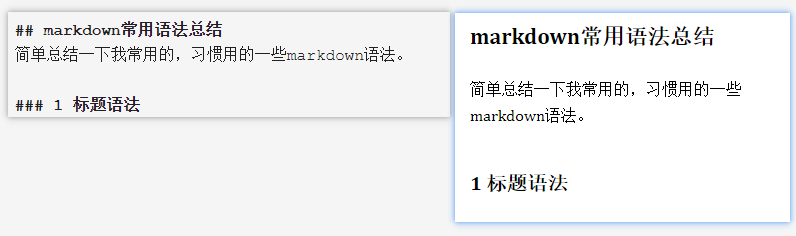  
### 2 换行语法 
- 句末加2个空格——换行方式1     
When I was young I'd listen to the radio,   
当我年少的时候，我总爱守在收音机旁。
- 句末加`<br>`——换行方式2 

Waiting for my favorite songs. <br> 
等待着我最心爱的歌曲从收音机里轻轻流淌。    
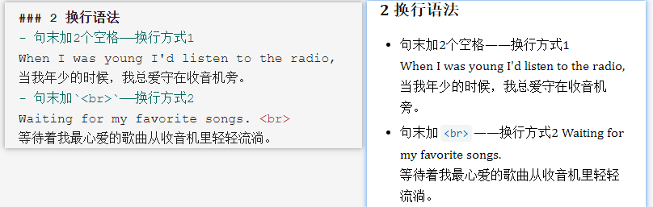  
### 3 段落语法 - 句末加`</p>`——下一段   
When they played I'd sing along,<br> 
每当歌声响起，我都跟着哼唱，</p> 
It make me smile.<br> 
这时的我，心神荡漾。
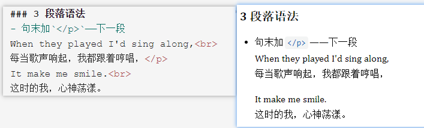 
### 4 强调语法 
分别为加粗，斜体，加粗&斜体 
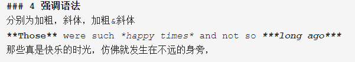  
**Those** were such *happy times* and not so ***long ago***    
那些真是快乐的时光，仿佛就发生在不远的身旁，  
### 5 引用语法  
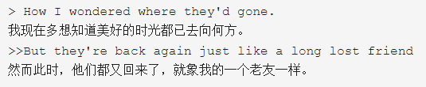  
> How I wondered where they'd gone.    
我现在多想知道美好的时光都已去向何方。    
>>But they're back again just like a long lost friend     
然而此时，他们都又回来了，就象我的一个老友一样。   

### 6 项目符号语法  
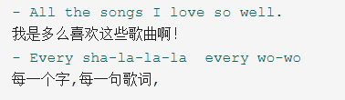  
- All the songs I love so well.      
我是多么喜欢这些歌曲啊！     
- Every sha-la-la-la  every wo-wo   
每一个字,每一句歌词, 
### 7 列表语法     
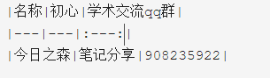  
|名称|初心|学术交流qq群| 
|---|---|:---:| 
|今日之森|笔记分享|908235922|     
### 8 代码语法  
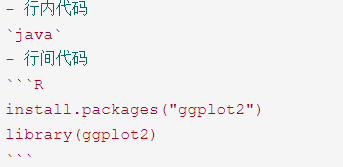  
- 行内代码    
`java`    
- 行间代码 

```R 
install.packages("ggplot2") 
library(ggplot2) 
``` 

### 9 分割线语法  
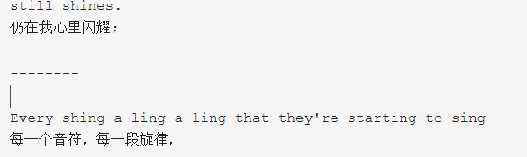  
still shines.     
仍在我心里闪耀;    

------- 

Every shing-a-ling-a-ling that they're starting to sing   
每一个音符，每一段旋律，

### 10 链接语法  

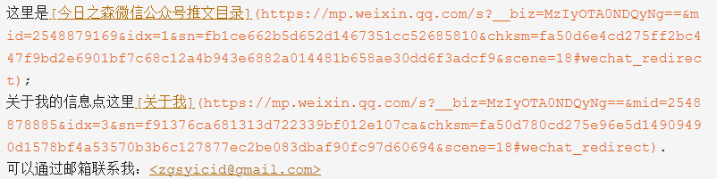  这里是[今日之森微信公众号推文目录](https://mp.weixin.qq.com/s?__biz=MzIyOTA0NDQyNg==&mid=2548879169&idx=1&sn=fb1ce662b5d652d1467351cc52685810&chksm=fa50d6e4cd275ff2bc447f9bd2e6901bf7c68c12a4b943e6882a014481b658ae30dd6f3adcf9&scene=18#wechat_redirect);  

关于我的信息点这里[关于我](https://mp.weixin.qq.com/s?__biz=MzIyOTA0NDQyNg==&mid=2548878885&idx=3&sn=f91376ca681313d722339bf012e107ca&chksm=fa50d780cd275e96e5d14909490d1578bf4a53570b3b6c127877ec2be083dbaf90fc97d60694&scene=18#wechat_redirect).  

可以通过邮箱联系我：<zgsyicid@gmail.com> 

### 10 图片语法 - 这是图片  

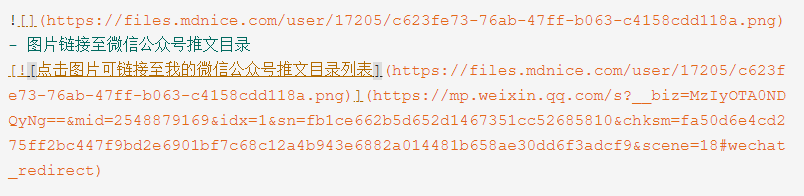   

- 图片链接至微信公众号推文目录 

[](https://mp.weixin.qq.com/s?__biz=MzIyOTA0NDQyNg==&mid=2548879169&idx=1&sn=fb1ce662b5d652d1467351cc52685810&chksm=fa50d6e4cd275ff2bc447f9bd2e6901bf7c68c12a4b943e6882a014481b658ae30dd6f3adcf9&scene=18#wechat_redirect)   