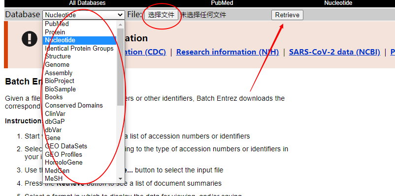
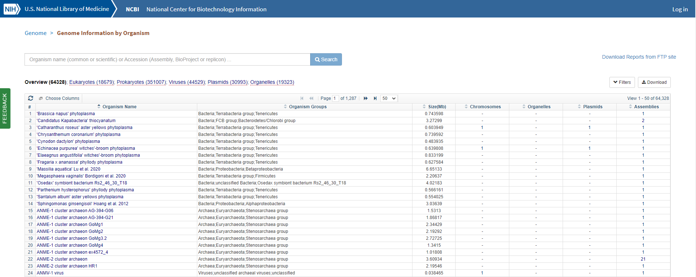

## 森言森语 

> 学过的内容总是容易忘记，有时候想用的时候苦苦想不起来以前是怎么弄的。慢慢的，我发现今日之森已经变成一个备忘录，有些学过的内容，记下来，想用的时候我也会第一时间在这里搜索。

## 两个内容 

>操作就很容易了，主要是保存一下这两个网址。

- **1 通过基因ID在NCBI批量下载序列信息**       

`用途`：有时候需要批量下载不同物种的多个序列信息，而只有ID，这时候就需要用到批量下载。    

NCBI提供了Batch EntreZ 

``` 
https://www.ncbi.nlm.nih.gov/sites/batchentrez
``` 

进入网站后，upload自己准备好的基因ID列表，选择需要检索的数据库，点击检索，即可得到需要的序列信息。

基因ID列表的格式，一行一个ID，txt。

 

- **2 批量获取基因组数据ftp链接后，wget下载**     

`用途`：有时候需要下载的基因组信息比较多，一个一个下那就累了；有时候一时间很难找到相对较全面的基因组信息，一个一个从文献中找或者google都不是易事，毕竟有很多物种都有很多不同的版本。所以就需要通过NCBI提供的Genome      
``` 
https://www.ncbi.nlm.nih.gov/genome/browse#!/overview/ 
```  
  
保存检索结果的ftp站点之后，保存为list文件。
然后通过如下方式下载 
``` 
$wget -c -r -i list 
```