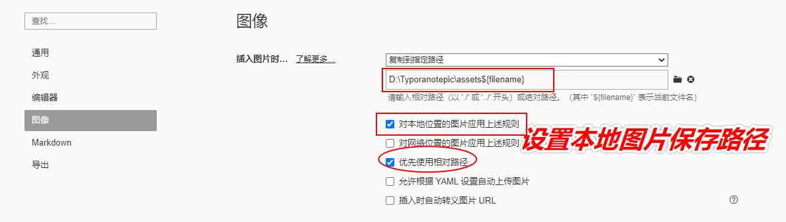

## 森言森语
>工欲善其事必先利其器。不论是写文本，作展示，记录代码，有一款趁手的笔记工具就很必须要。

### 记录方式
首推markdown
推荐理由：直接，简约，清楚。
比如我后期的公众号都是通过markdown记录的。
### 云笔记本构建
云笔记本的构建，对我而来图床的设置最为必要。因为Typora软件如果不设置图床的话，所有的图片都是在本地，这样就很不利于分享。主要是不能很方便的同步到微信公众号。所以下面主要解决图床问题。
- **1 Typora下载与安装**
  
```
https://typora.io/
```
作为编辑器,下载安装之后就可以直接书写了。  
具体的markdown语法在下一期具体介绍。
**简单设置一下**    
第一步

第二步

简单设置以上两步足够

- **2 Git安装**    
**借助github托管笔记**   
```
https://git-scm.com/
```
安装好之后加入环境变量。
- **3 注册github账号**     
略……    
然后在github新建一个用于管理笔记的仓库。

- **4 建立ssh连接**
```
#打开terminal终端
PS C:\Users\zhaoguosen> e:
PS E:\> mkdir jinrizhisen
PS E:\> cd .\jinrizhisen\

#获取ssh公钥，保证本地和远端github可以连接
PS E:\jinrizhisen> ssh-keygen -o
PS E:\jinrizhisen> cat C:/Users/zhaoguosen/.ssh/id_rsa.pub
#然后将获得的一串公钥字符添加到github中。如下图：
#将github新建仓库的git复制到本地
PS E:\jinrizhisen> git clone git@github.com:guosenzhao/new_notes.git
#创建一个子文件夹，用于更新文献公众号推文
PS E:\jinrizhisen> mkdir wechat
```


准备就绪，就可以测试一下。

### 测试环节
打开刚才新建的文件夹，新建一个`test.md`

随便写一点。


然后通过git从本地上传到github。
```
PS E:\jinrizhisen\new_notes\wechat> git add .
PS E:\jinrizhisen\new_notes\wechat> git commit -m "add all"
[master 9884b1f] add all
 1 file changed, 15 insertions(+)
PS E:\jinrizhisen\new_notes\wechat> git push
Enumerating objects: 7, done.
Counting objects: 100% (7/7), done.
Delta compression using up to 4 threads
Compressing objects: 100% (2/2), done.
Writing objects: 100% (4/4), 417 bytes | 14.00 KiB/s, done.
Total 4 (delta 0), reused 0 (delta 0), pack-reused 0
To github.com:guosenzhao/new_notes.git
   cfca1e5..9884b1f  master -> master
```
这样就算上传完毕了。打开github看一下。


好的。我主要还是想测试一下图片。看一下图片文档编辑完之后复制到微信会不会同步图片。


这里插入了两种格式的图片。


可以看到，图片链接是可以显示的，而本地图片显然没有被同步。
这个问题一时半会儿也解决不了，起码代码之类的可以同步保存了。