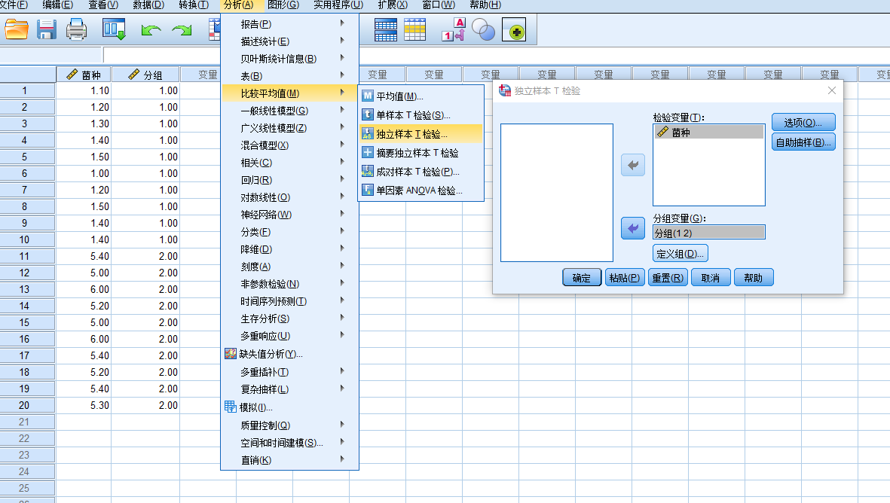

## 森言森语 >越是基础的知识点，就越容易被我们忽略。
>>如果不重视实验设计，而只是埋头做实验，其后果可想而知。
> >>如果不重视数据分析，而只是统统拿来一把抓，其后果可想而知。

## t检验的三种情况 
 
通常，t-test是我们处理数据过程中经常用到的统计学处理方法。刚才看了看原理和推导过程，头疼，虽然好像简单，但是究其原理还是有些麻烦。所以就简单介绍三种我们在数据处理过程中经常遇到的几种情况。
### 1 单样本t检验 
>情况一：      
分析一组样本（10株转基因小麦株高）和一个已知总体（正常小麦株高平均为67cm）进行比较  

##### SPSS具体操作   
  
##### 结果分析  
 
- 单样本统计    
基本统计描述指标的统计量：个案数即样本量为10，样本均数为56.00、标准差为2.21、标准误为0.70。
- 单样本检验     
t=-15.73，自由度=9，P=0.000，样本均数与总体均数之差为-11.000，差值的95% 置信区间为（-12.5817，-9.4183），不包括0，差异有统计学意义。
##### 结果表述 
转基因小麦样本数n=10，平均株高为56.00±0.70 cm，与普通小麦株高的平均67 cm比较差异，有统计学意义（t = -15.732,P = 0.000）,可以认为该转基因小麦株高较普通小麦株高偏低。
### 2 成对样本t检验 
>情况二：    
10株小麦接种条锈菌48h后PR基因较未接种时的表达情况。

##### SPSS具体操作   
  
##### 结果分析  
   
- 配对样本统计     
样本量为10对，未接菌与接菌情况下PR蛋白的表达量的均数分别为1.09和5.09，标准差分别,0.16和1.20、标准误分别为0.05和0.40。
- 配对样本检验    
接菌-未接菌差值的均数为4.00，标准差为1.17，标准误为0.39，差值的95% 置信区间为（3.10,4.90），t=10.280，自由度=8，P=0.000，差异有统计学意义。
##### 结果表述     
10株小麦在接菌、未接菌情况下PR蛋白的表达量比较，采用配对样本t检验，接菌、未接菌的PR蛋白表达量（5.09±1.20和1.09±0.16）比较差异有统计学意义（t=10.280， P=0.000），可以认为小麦接种条锈菌后诱导PR蛋白的表达。
### 3 独立样本t检验 
>情况三：    
20株小麦分为2组，其中10株接种条锈菌，10株接种赤霉菌，探究48h后PR蛋白的表达情况。

##### SPSS具体操作  
 
##### 结果分析  
 
- 组统计    
样本量为20（条锈菌与赤霉菌分别为10），条锈菌与赤霉菌的均数分别为1.3和5.39、标准差分别为0.17和0.35、标准误分别为0.05和0.11。    
- 独立样本检验 若方差齐性假设（莱文方差等同性检验）满足，则读取第一行t检验的结果，否则读取第二行t检验的结果。    本例结果：经方差齐性检验得：F=1.917，P=0.183，可以认为方差齐同，读取第一行t检验的结果。t=-32.923，自由度=18，P=0.000，均数的差值为-4.09，标准误为0.124，均数差值的95% 置信区间为（-4.35，-3.83），差异有统计学意义。
##### 结果表述  
略。
## 结语 
其实本来我想在成对样本t检验和独立样本t检验中使用同一组数据，但是不小心删除了，懒得输入。感兴趣的朋友可以试试，如果需要使用成对样本t检验时用了独立样本t检验会怎样呢？
