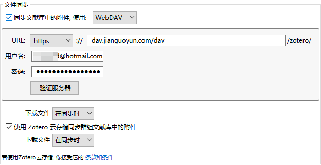

>在一个环境中呆久了，真的会自我禁锢。晚上骑车出门吃饭，就感觉好久没有出过校门了，真的是远离尘嚣了么？这种感觉还真是惊恐。

卸载endnote后，我才真的开始喜欢上看文献。
endnote是口耳相传的文献管理神器，我很久之前就下载了，没有正儿八经的用过。唯一的感觉就是，太卡了吧。     
作为还没有入门的搬砖小白，尽管没有看过多少文献，但是起码还是屯了几百篇……，于是就很卡很卡，甚至导致电脑死机……，于是只能卸载endnote。


于是安装了Zotero
- 开源
- 轻便
- 支持markdown
- 方便记笔记
- 支持第三方云盘同步数据
- ……   
安装流程
```
#首先下载安装zotero
https://www.zotero.org/  
#安装后顺便在官网注册账号，注册后在本地登录
#由于我是markdown深度使用者，所以优先下载安装了，不用Markdown的可以skip
https://addons.thunderbird.net/zh-cn/thunderbird/addon/markdown-here-xul/
#这是另一个插件，我忘了具体干啥的，反正安装就行了
https://github.com/wshanks/Zutilo/releases
#全部插件列表，需要哪个就下载哪个
Zotero全部插件列表: https://www.zotero.org/support/plugins
```

反正下载之后我琢磨了一晚上，才能稍微熟练使用，相比endnote而言，学习成本会高一点，毕竟endnote除了让电脑END之外感觉也没啥别的让人称赞的功能。而zotero可以做到极简，轻便。但在使用过程中还是有些坑。遂罗列如下，为后来者避坑。        
当然，土豪如果直接购买zotero专业版，就会少很多事。    
## 坑一
`导入zotero的全部文献同步管理问题。`      
以前很多文献都在不同的位置，无法做到云同步，时间久了容易文献库杂乱，可能会产生很多重复文献，无法很好的管理。另外无法云同步，换个电脑或者零时换个地点就很难及时访问自己建立的文献库。
由于zotero自带网盘只有300M容量，显然不够用。于是需要第三方网盘工具。
- 解决办法
注册坚果云网盘
```
https://www.jianguoyun.com/
```
在坚果云网盘产生如下页面

然后打开zotero进入如下页面。**注意看输入信息，非常重要!!!**

我就是没注意到上述问题，而浪费了一个多小时……
## 坑二
`重复导入的文献如何合并后删除冗余文献`       
其实zotero在导入文献后，就会自动获取PDF元数据，时间比较长，一开始我也不知道这是干啥的，而我比较心急，刚开始安装的时候没注意给关掉了。   
结果后面发现重复导入了很多文献，一时间不知道如何删除重复文献，琢磨了一会儿发现重新获取PDF元数据之后就可以删除重复条目了。但是由于每个PDF的重复情况不一样，所以zotero需要在合并时手动选择最终保留哪一个PDF，如果有几百篇文献就很麻烦，肯定不能一个一个去点。      
所以需要在建立元数据之后，在重复条目中，全选条目，然后在工具栏运行java script。输入如下：
```
var DupPane = Zotero.getZoteroPanes();
for(var i = 0; i < 100; i++) {
await new Promise(r => setTimeout(r, 1000));
DupPane[0].mergeSelectedItems();
Zotero_Duplicates_Pane.merge();
}
```
注：这里的100可以根据实际情况自己修改。

总而言之，zotero会作为我以后长期唯一使用的文献管理工具。