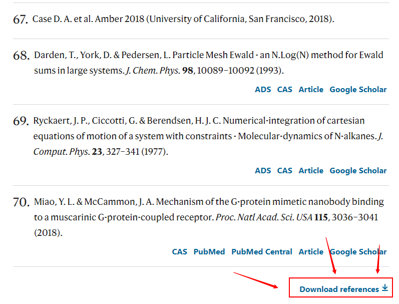

## 森言森语
> - 除了掌握基本的实验技能之外（这是最低要求，所以就不用特别指出），我认为研究生阶段最重要的特质是要对所研究的领域有基本了解和大致判断，也就是说要对未来的发展方向有初步的认识，并对当前阶段文献的基本把握。
> - 研读领域内重要综述是必要的。

所以今天主要分享如何快速获取经典文献或综述所引用的参考文献。通常来说，新进发表的重要综述基本涵盖了领域内过去几年或几十年的重要发展概况，所以对于了解一个新的领域而言，阅读新进发表的重要文章或综述尤其重要。

今天，我就以2021年7月6日发表在《nature communication》的论文“**Structural basis for chemokine recognition and receptor activation of chemokine receptor CCR5**”为例，追踪这篇文章所引用的所有参考文献，并快速导入文献管理软件Zetoro或Endnote，一键获取全部参考文献的PDF文档。~~（由于我用的是Zetoro，所以以Zetoro为例，但操作是一样的。）~~

- **第一步，检索该文献。**

首先，通过浏览器搜索该文献（或者`pubmed`，`google scholar`，`web of science`等，总之搜到这篇文献就可以了。）
- **第二步，在页面往下拉，找到reference，并在reference列表最后找到download reference。**

点击下载后，即可得到一个.ris文本文档，该文档是可以直接导入Zotero或endnote的。

- **第三步，导入Zotero或endnote**    
对于Zotero软件，点击刚才的.ris文档，即可自动导入。

可以看到，刚才检索到的70篇参考文献已经全部导入，导入之后我们可以根据发表年份，期刊，标题等信息来筛选值得研读的文献，然后一键搜寻选中文献的PDF文档。

万事俱备，接下来就需要宁心静气沉下心来研读文献了。
>同样，人性的弱点就是，做到这一步很容易，下一步就太难太难。

对于endnote软件也是一样，可以通过菜单栏手动导入.ris文档，到入之后亦可以find full text。

刚才的演示实际上是在nature网站进行的，实际上在pubmed，web of science等的操作类似。

除了考虑参考文献，其实也可以检索被引文献。

由于该文太新了，目前还没有更新被引文献信息。不过我们可以换一篇老一些的文献看看。
比如这篇1999年7月6日发表在《Proc Natl Acad Sci U S A》的论文“**Five-transmembrane domains appear sufficient for a G protein-coupled receptor: functional five-transmembrane domain chemokine receptors**”。我们来检索一些这篇文献在过去20多年的被引用情况。

可以看到，pubmed收录了19篇被引论文。点击see all。

然后就可以选中感兴趣的被引论文，这里因为只有19篇被引论文，简单浏览一下就大概有个判断。这里我将搜索结果按期刊影响因子排序，比较关心排在最前面的几篇顶刊论文。选中后可以通过多种方式导入Zotero。

- 然后就可以通过多种方式导入Zotero。比如这里我们通过保存为pubmed格式，导出选中的文献。

同样，会生成一个文本文档。

然后从Zotero导入该文档即可。

即可成功导入。一键获取导入的2篇论文的PDF文档。

可以看到，两篇论文的PDF文档均已获取，可以预览查看。

**到此为止，基本上就可以通过很快的方式获取到领域内相关文献的大致情况。**

基本上，我们就可以通过这种方式去追踪想要了解的领域。

-------
最后，细心的朋友们发现，我的pubmed有些不同，这里给大家分享几个插件或技巧，可以更好的配置你想要的pubmed或者Zotero软件。

~~(下面的图片可以点开啊)~~ 
##### 1 自定义Zotero文献管理软件
   
##### 2 Pubmed实时显示最新影响因子及中科院分区

##### 3 推荐浏览器插件    
- 文献直达下载按钮，类似于sci-hub。
https://unpaywall.org/    
添加到浏览器即可使用。    

先写到这里，该跑步了。

