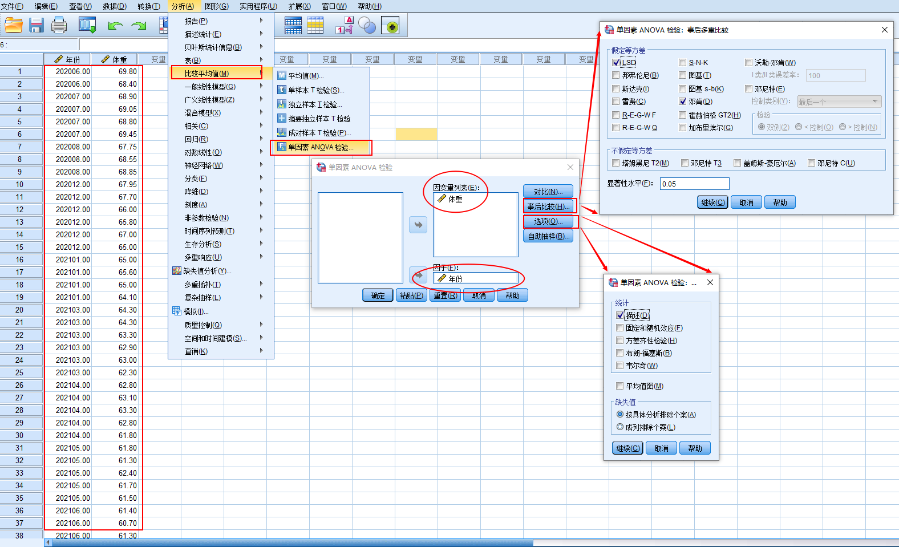
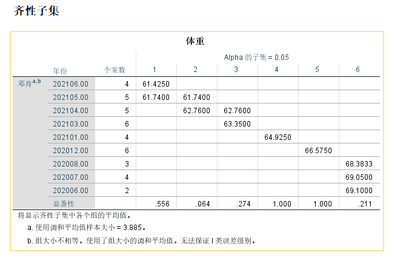
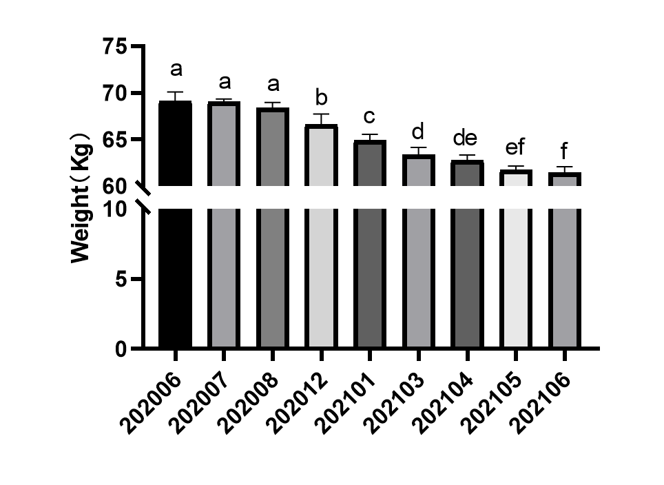

## 森言森语 
>显著性差异分析之后，需要标注差异结果。通常有两种方式，即：用\*标注；或者abcd标注。    两种方式都是可以的，不过当组别较少时，可能\*较为直观；当组别较多时，abcd更为简洁。      

## 显著性差异字母标记法    

- 首先将全部平均数从大到小依次排列，然后在最大的平均数上标上字母a； 
- 并将该平均数与以下各平均数相比，凡相差不显著的，都标上字母a，直至某一个与之相差显著的平均数，标记字母b； 
- 再以该标有b的该平均数为标准，与上方各个比它大的平均数比较，凡不显著的也一律标以字母b；再以标有b的最大平均数为标推，与以下各未标记的平均数比，凡不显著的继续标以字母b，直至遇到某一个与其差异显著的平均数标记c。    

**凡有一个相同标记字母的即为差异不显著,凡具不同标记字母的即为差异显著.**   
**一般小写字母表示显著水平α = 0.05；大写字母表示显著水平α = 0.01**      
## 简单举个栗子     

分析一下过去一年每个月我的体重变化是否显著。应该还蛮有趣的。
这里就用SPSS来做单因素方差分析。是因为我感觉结果会清晰一些。当然实现的方法太多。
   
 结果还不错。
  
试着标一下abcd……  
 
## 结果分析     
说明我的体重自去年8月份持续跑步以来，每个月都以极显著的趋势下降，但随着体重接近60kg，下降趋势逐渐缓慢。     这就说明还是可以随时控制体重的嘛。
 题外话，其实上图一看就是graphpad做的，但实际上像这种显著性差异分析在graphpad或者origin就可以完成，没必要额外使用spss。只是我觉得spss的结果更直观一点，不容易标错。