## 森言森语
>TBtools是一款优秀的生物信息学软件，也是我最早接触的生物信息学软件。从接触到现在差不多一年，边使用，边积累，算是学习路上的一款启蒙软件。    
有幸在我写公众号记录分子生物学实验原理和生物信息学一些小技巧的过程中，得到CJ多次鼓励和支持。    
TBTools更新频率之快，以至于很多新添加的功能我都不知道。

其实早在年初还在家的时候，就已经写过一些推文介绍过一些功能，后来陆陆续续又写了一些。但总感觉有缺憾，尤其前段时间写了一篇《基因家族分析》的万字长文，本来目录写的好好的，无奈最后还是烂尾了，到最后只得东拼西凑拿以前的推文堆砌。想要完整的完善那篇推文亦力不从心。毕竟现在TBtools的功能越来越多，几天不用就有新的功能。

就目前来看，想要系统介绍TBtools的全部功能，肯定是一个浩大的工程。在我最初使用的时候，功能还是不是特别多，那时候还见过几位前辈写的《TBtools使用手册》，后来就很少见了。

今天我也不可能穷尽全部功能。TBtools作为一款集成了丰富功能的生物信息学软件，我觉得完全可以作为我们日常实验过程中的辅助工具。对于不习惯使用命令行操作的大多数硕博士研究生而言，这款软件无疑是神器。

------
下面就自己的使用经验，写一篇正确打开TBtools的经验贴，俗话说，授人以鱼不如授人以渔嘛。顺便为刚接触软件的新手抛转。    
## 1 界面介绍

**The only limit to our realization of tomorrow will be our doubts of today.**      
从界面来看，主要被分为几个模块：
>- sequence toolkit
>- blast
>- GO&KEGG
>- graphics
>- others
>- games

想要说明功能就在对应的模块下面寻找即可。但现在TBtools少说也有几百个功能了，这对于新手来说却是麻烦，所以如果从别人写的教程里面看到的功能。自己却找不到对应功能的时候，就从以下三个方面考虑解决：

- 首页搜索

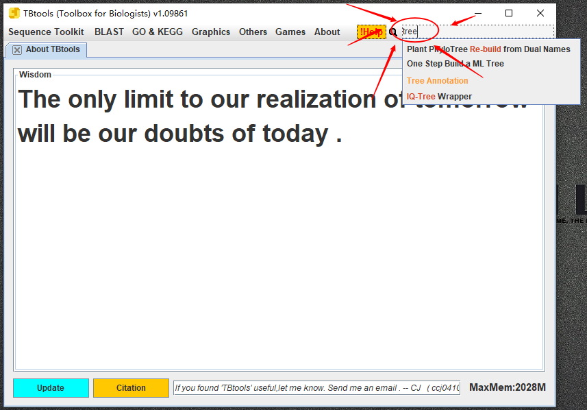
- 更新到最新版

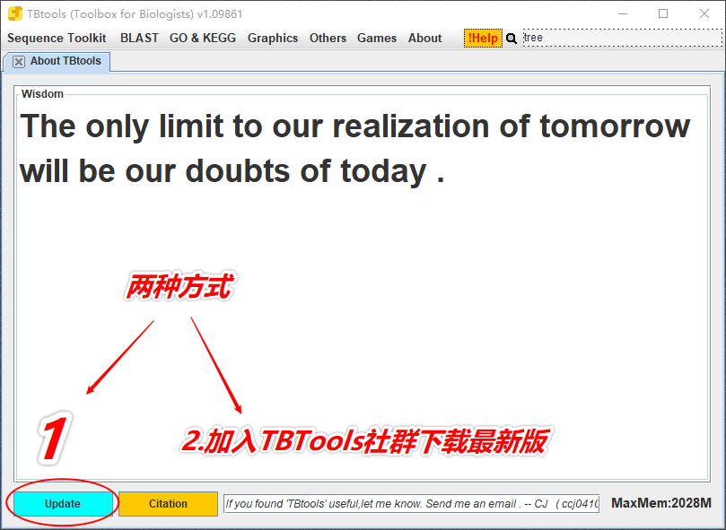
- 在插件商店寻找

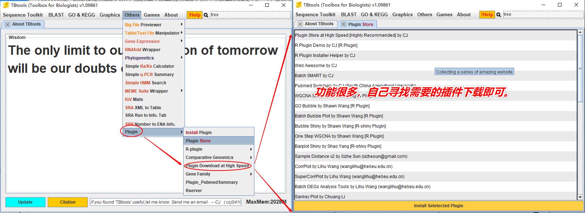
## 2 注意事项    
TBTools的主菜单功能一般不会出错，如果出错，大概率是自己输入文件格式不对。这是新手最常遇到的问题。    
>- 输入文件格式错误的情况下点击1000次start也还是黑框报错。所以，一旦报错，首先考虑检查输入文件格式是否正确，gene ID是否对应等情况。
>- TBTool大多数功能的名称就是该功能的一句话描述，所以很好找，一般不会迷路。问题还是出在输入文件上。大多数情况下TBtools每一个输入窗口的上方都有对输入文件格式的简要描述，输入文件前首先需要核对格式。输出窗口通常也有简要说明，什么时候需要设置输出文件名，什么时候又只需要设置输出路径。比如下面这样，就闭着眼睛输入就好。
> 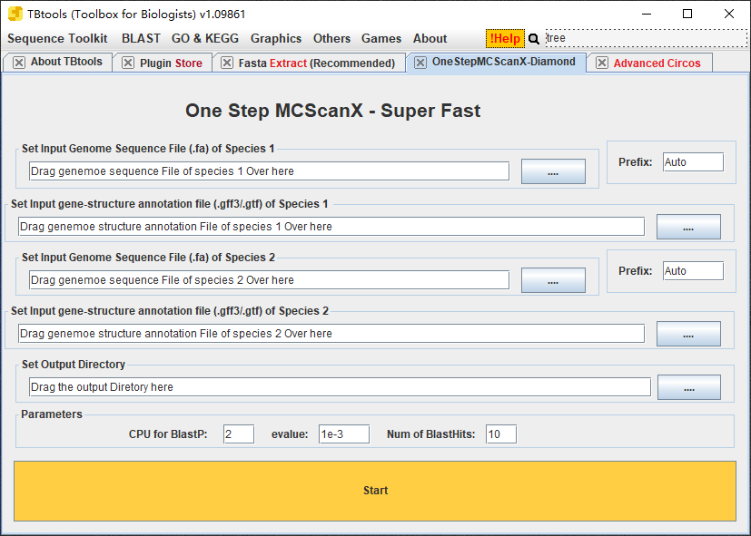
>- 如果在输入文件格式完全没问题的情况下，小概率是TBtools在更新过程中出了bug，在社群交流就好，通常会被很快修复。    
新手一般不会遇到这个问题，所以还是一定要首先考虑自己输入文件格式是否正确。
>- TBtools几乎所有的功能使用逻辑都是一致的，即IOS：Input、Output、start。      
如果熟练使用5-6个不同的功能，相信几乎所有的功能都能信手拈来，这也就在很大程度上减少了使用成本。毕竟，TBtools的目的不就是为广大非生物信息学专业的研究生们提供便利么。

## 3 牛刀小试
通过以上简要介绍，相信对TBTools的使用策略就有基本认识了。下面就简单举几个栗子实际操作一下。      
#### 3.1 序列下载    
这个功能我以前很少用，但是刚才在写推文前，浏览了一遍菜单栏，感觉有趣，就试了一下，很不错。     
正好最近从一篇文献中下载了PR蛋白accession number。其实我早在NCBI下载过了，但是相对还是麻烦。下面使用TBTools试试。

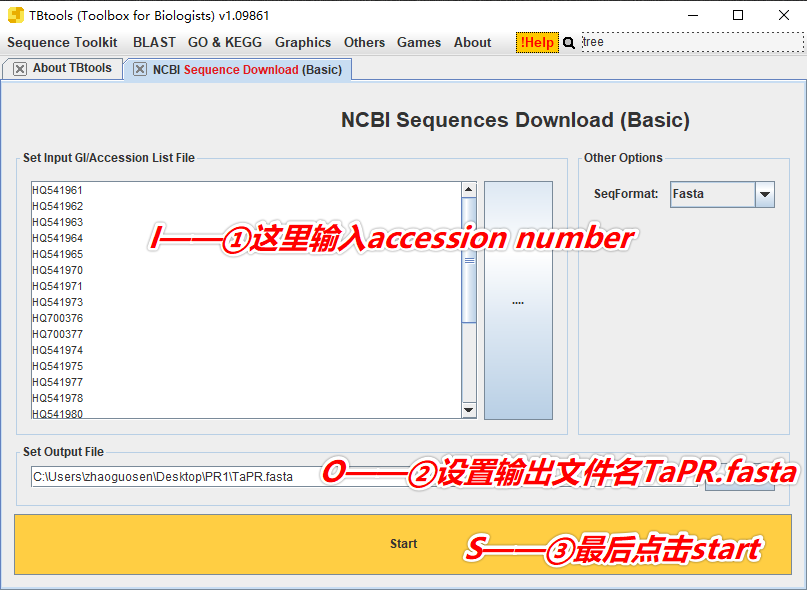
稍等片刻

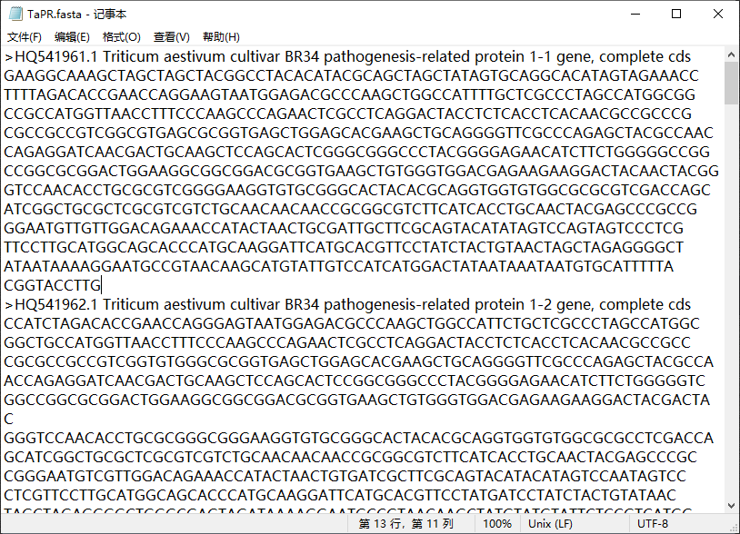
就很爽。
#### 3.2 ID 简化
可以看到这里的gene ID包含description information，就很烦，通常我们只需要很简单的ID就好了。卡按着舒服。

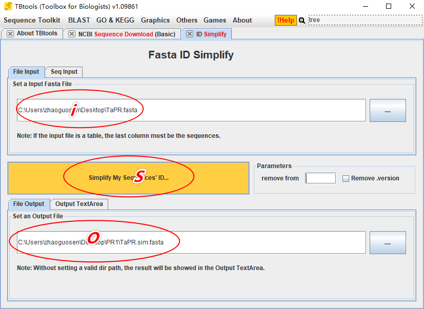
OK
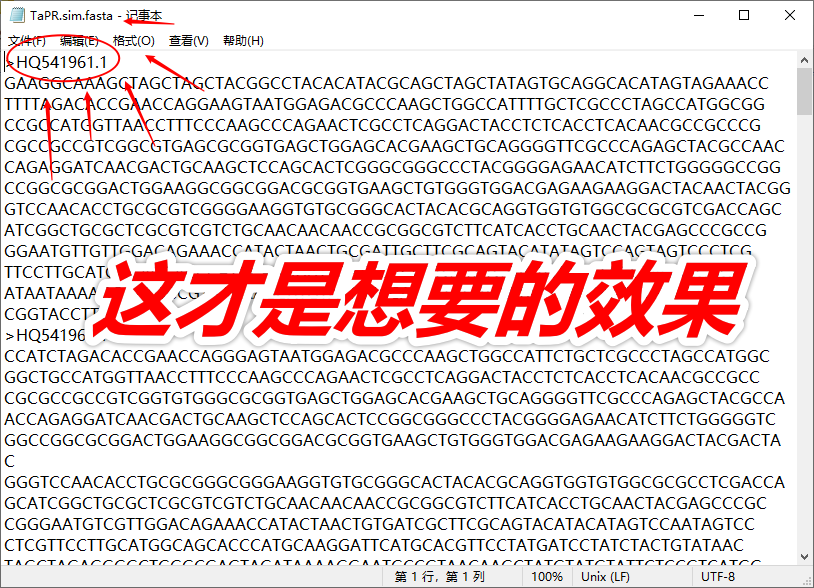

#### 3.3 一步构建系统发育树One step build a ML tree
我这里之前还下载了PR蛋白的氨基酸序列，一步操作建个树试试看。

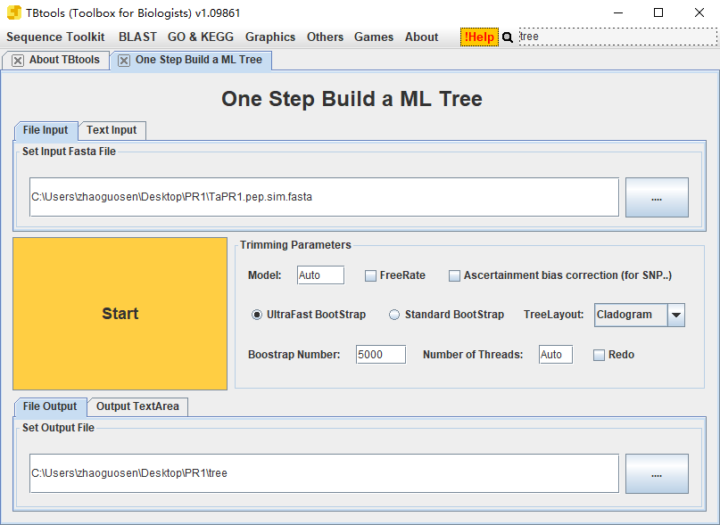
简化版的树，可以简单看看
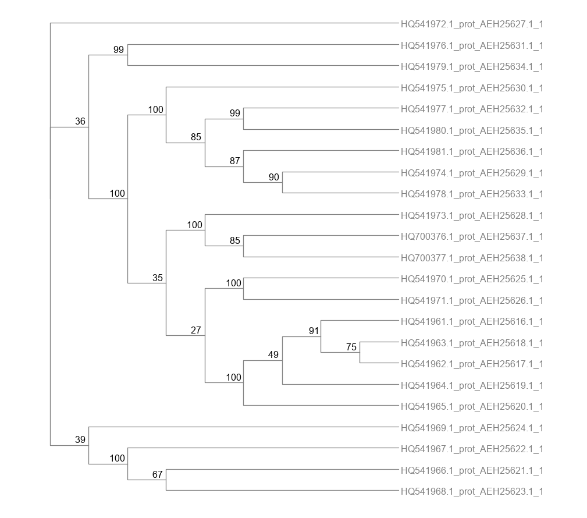
查看输出结果
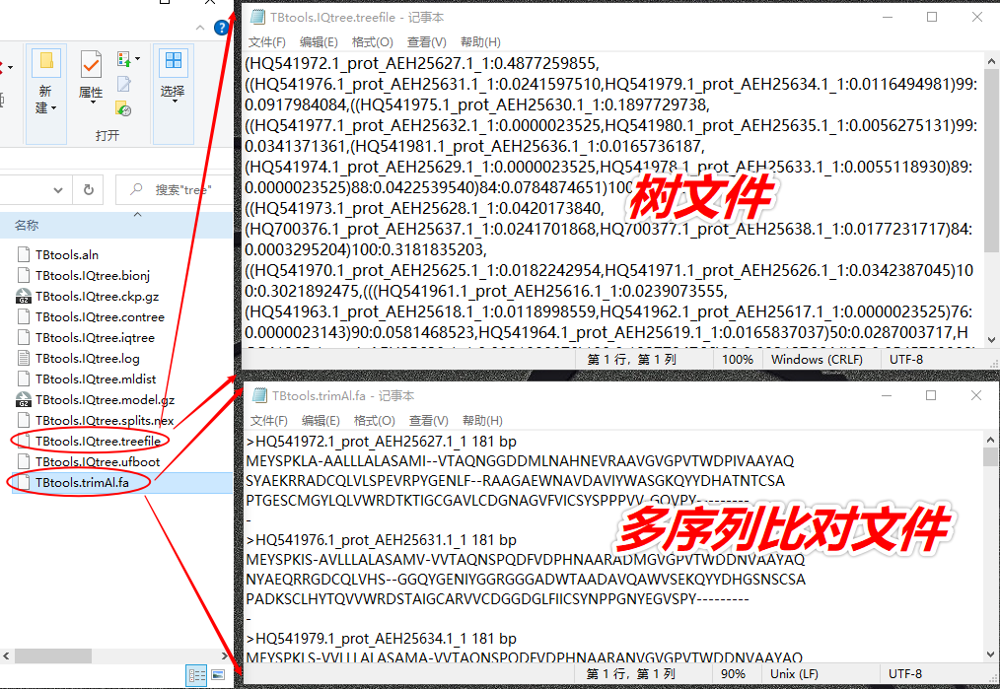

## 4 资源获取
今天没有详细堆砌功能介绍，而是就使用策略简单写一点砖头。TBtools功能那么多，去哪里获取详细教程呢。    
包括《生信药丸》在内的很多公众号都在写TBTools的教程，所以，基本上大多数功能的使用方法都在微信`搜一搜`可以找到。

简单写到这里，其实多用几次就很容易上车。

## 结语
软件确实是方便了我们。但是很多事都不简单，做科研嘛，哪儿有什么捷径。只有稳扎稳打扎扎实实才能一步一个脚印。     
对于上述的一步建树法，很完美的做到了输入未比对的氨基酸序列，然后输出树文件。但是个中道理还有必要花些时间了解一下，万一开题答辩的时候被答辩老师问呢？    

另外经常遇到的问题是共线性分析的问题，很多时候不明白共线性分析的目的和根本逻辑，分析了一大堆，做了个圆圆的圈图，有啥用呢？万一毕业答辩被老师问及，怎么解释呢？

## 引用

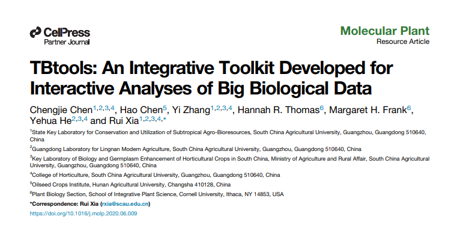

