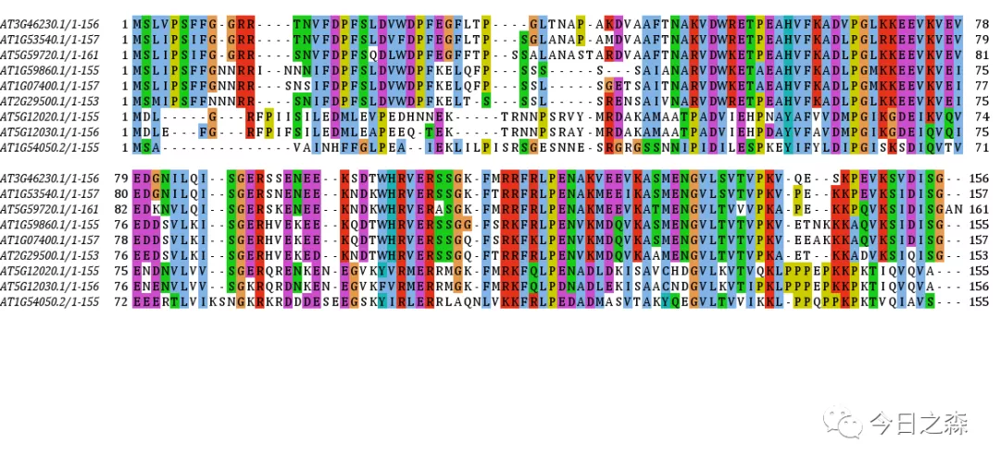
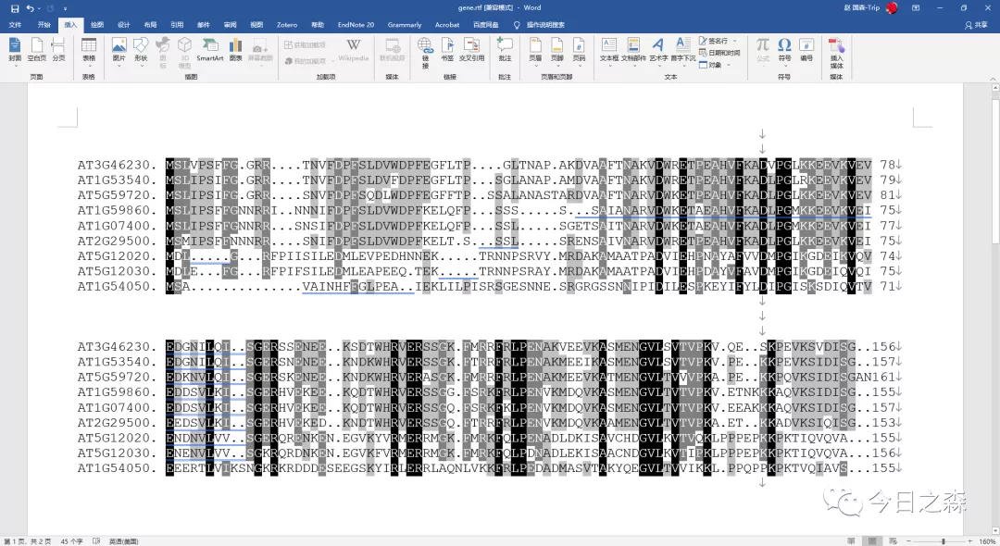
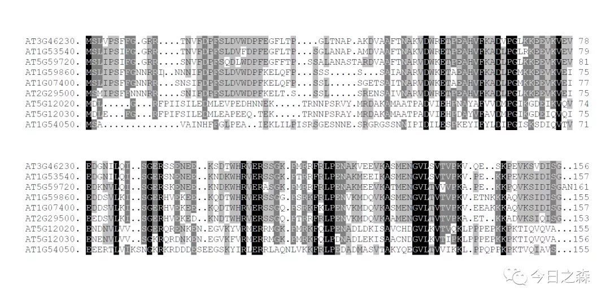

森言森语 

毕业季，总会有各种各样的遗憾，但我们还是期望认真、努力，好好对待遇见的人和遭遇的事，少一些遗憾，多一些收获。毕业前我们总是嚷嚷着要毕业，马上就要离开学校的时候，其实也有很多人值得感恩，有很多事值得回忆，但终究遗憾会更多一些。我常说，但愿每次回忆，对生活的都不感到负疚。这句话被我安排在了简历的最后，我想等我毕业的时候，这句话也要被放在答辩PPT最后一页。

毕业论文中的遗憾

毕业论文是一个人一生中极为重要的知识产出，每一个阶段的毕业论文也是那一阶段在学术，生活，情绪各方面的总结，是一个阶段最具代表性的材料。但是我们都知道，毕业论文不可能完美，只要愿意去检查，总能发现这样那样的问题，不同的时期回过头去看，发现的问题就更多。因此，我们实在是有必要有意识的从逻辑、措辞、格式等各方面不断提高毕业论文的水准，以最大限度推敲逻辑上的合理性，措辞上的严密性，格式上的规范性。这样，若干年后再回首，翻开论文的时候，才不至满是遗憾。

多序列比对结果的可视化效果

毕业论文中的多序列比对结果模糊不清晰是一个广泛存在的通病，存在这一问题的原因是多数时候我们都选择了把多序列比对结果以图片的形式插入Word，如果图片本身不是矢量图，那插入Word只会让自己的比对结果糟糕的展示在答辩评审老师面前，如果图片本身是矢量图，插入Word后或许还说的过去，但终究比不上嵌入Word文档中的字符形式所呈现出来的效果，达不到绝对的高清，绝对的矢量。

在我的本科论文中当然也存在这个问题，那就是多序列比对结果展示效果不佳，但是当时我还意识不到这个问题，后来的一年多，在我翻过的博硕士论文中，该问题普遍存在，显然没有得到大家普遍的足够重视。但既然作为论文中的一个图，我们就有必要让展示在论文中的图表满足自明、严谨、科学、矢量、清晰的特性。

关于多序列比对

关于多序列比对结果的可视化，前面的推文中提到了很多的软件，其中DNAMAN软件《解锁DNAMAN更多功能——》是我用的时间最长的多序列比对及可视化软件，但是自从发现某些bug《又在我的本科毕业论文中发现了一个bug》之后，我就卸载了；后来发现Jalview《科研作图Jalview软件：多序列比对结果-美化-编辑》《详解多序列比对软件Jalview的使用方法，美化-编辑-自定义设计》很不错，起码没有上述的bug，另外其具有丰富的比对策略，比如Muscle和mafft，比对之后同样可以进行一定程度的美化，其内置的clustalX配色尽管还能说的过去，但还是过于花里胡哨，不符合我的审美，其他的配色方案操作起来其实蛮有难度，主要是自定义模式对个人的审美要求更高，反正我达不到自定义一个符合自我审美的配色方案。

何况Jalview软件中的gene name好像只能是斜体，这就让我很不爽啊，或许可以改，只是我没找到更改办法。于是不得不寻找下一款替代软件，那就是GeneDoc，简简单单，又很朴素，挺好。

但是GeneDoc只能对比对结果进行进一步编辑和美化，其自身不具有比对功能，这一点可以接受，主要是该软件出图效果极好，可以直接将比对结果嵌入word文档，而且是矢量效果，嵌入Word后还可以随意修改，因为输出结果并不是图片，而是字符，可以对其中的任何元素进行任意编辑，但似乎没必要。无法导出图片格式的可视化结果算是个缺点。但是不重要，只要可以导入Word那就可以保存为pdf，只要能保存为pdf，就可以用AI处理后输出矢量图片。

最重要的是Jalview和GeneDoc免费，所以，使用Jalview进行多序列比对，然后将比对结果导入GeneDoc美化，再然后将可视化结果嵌入你的毕业论文Word文档中，就再也不会有评审老师说你的多序列比对结果不清晰了！！！

下载地址

http://www.jalview.org/getdown/release/
https://github.com/karlnicholas/GeneDoc

安装说明：下载后一路next即可完成安装。

由于软件使用过于简单，就不对GeneDoc的功能逐一演示了。直接出效果图来看差异。使用的序列还是之前多次用到的Athsp20氨基酸序列。（DNAMAN已经被我卸载，所以这里不再拿DNAMAN做可视化。）
示例一：Jalview可视化结果-ClustalX配色

缺点：
gene name是斜体，这点不好；

配色过于复杂，整体视觉效果不是很好；

png为非矢量图，看上去就很糊；

导出的图片下面还有一大片空白，还需要通过截图编辑，越编辑越糊。

示例二：GeneDoc可视化结果
（由于GeneDoc无法导出图片，因此这里展示了截图效果，但总体看起来真的很不错。这里默认模式为黑白灰配色，其实用户可以自定义配色，但是黑白灰逼格很高好吧，还自定义费那劲干啥。）

下面，将其保存为pdf来看看效果。
无疑，是绝对的矢量图，绝对的清晰，看起来逼格也蛮高的。

这应该是毕业论文中嵌入多序列比对可视化结果的最优方式了吧？
如果你的论文中需要嵌入多序列比对结果，不论答辩结束与否，不妨试一试。

一些思考

对于很多软件开发者来说，他们其实实际上也不能穷尽所有的功能做出最优的可视化结果，比如R语言ggplot2包，一句话总结，他们尽管开发了软件，但至于如何使用软件，全在用户自己。因此，在这篇推文中我极力推荐各位朋友使用GeneDoc来产生多序列比对结果，然后将其嵌入Word文档中，这种方式展示出来的效果堪称完美。