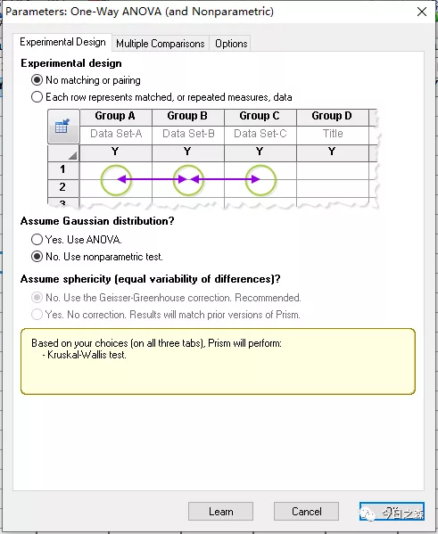

接着之前的推文技巧（2）——GraphPad Prism作图|柱状图①，专门写一下利用GraphPad进行单因素方差分析与多重比较。

【进入正题】
数据背景：将Pyricularia grisea分别在4、13、25、30和37℃下培养4 d后测量菌落直径，以研究其最适生长温度，并分析各组之间有无显著性差异。数据测量结果如下：

由上述数据可知，有5组独立实验（n>=3），因此这里选用单因素方差分析（One-way ANOVA）。如果n=<2，则可采用t测验。

 第一步，打开GraphPad,并将上述数据导入。
 
 
 第二步，生成柱状图。

点击OK后，图片大体定型。通常来说，科研作图以黑白灰为主，但其实只要配色美观，都是可以的。但在毕业论文打印时，通常黑白打印，因此在设置黑白灰或者彩色时，打印效果会大打折扣，因此更多时候会采用网格区分。

先看颜色设置：

简单看几张效果图：

颜色先看到这里。

再看网格设置：

刚才注意到，25℃的bar几乎看不到，这里我们对柱状图的边缘线粗细调整一下。

大致如下：

在此基础上进行网格区分：

第三步：方差分析

可以看到，分析结果有两部分。一部分为ANOVA结果；另一部分为Multiple comparisons结果。
   那这两部分结果如何解读呢？
 首先来看ANOVA分析结果。ANOVA分析首先假设各组平均值无显著性差异，但分析结果发现P<0.0001，拒绝原假设，结果表明各组平均值有显著性差异。ANOVA回答的问题到此为止。换句话说，ANOVA分析结果表明本次分析的5组实验均值之间有差异，但具体差异并不知道。
   如果需要进一步了解详细差异，则需要查看多重比较结果。
   

这里使用的是Tukey‘s多重比较。

下面对上述分析结果进行显著性差异标注。（只标注一部分）

n.s.：not significant  * p<0.05; ** p<0.01, *** p<0.001; **** p<0.0001    

但是到这里还没有结束。

 通常来讲，我们在进行ANOVA分析时，有两个假设，一个是正态性假设，一个是方差齐性假设。但是这两个假设对于小样本来说必要性不是很高，但样本量较大时，应尽可能满足这两个假设。
 
 
   那接下来就理解一下这两个假设。
 那我们就来看看这几个小样本数据是否满足正态性。

由下面结果可以看到，2组和4组正态性检验p>0.05,通过了正态性测试，认为这两组数据在0.05水平下符合正态分布。

而其他三组由于数据量太少，不足以判断正态性。

再来看方差齐性假设：

上述分析结果中的两个test都是针对方差齐性的。

先看Brown-Forsythe test，其SD显著不同吗？回答是No，那意思就是相同的，即满足方差齐性。

再看Bartlett’s test,其回答是yes，即不满足方差齐性。

一个满足一个不满足，那怎么考虑，其实对于小样本而言，方差齐性和正态分布都是可以忽略的。

比如，假设在0.05水平不满足方差齐性，那我们可以通过调宽α的范围，使其满足方差齐性，以便进行后续的ANOVA，最后标注清楚即可。

最后，再来看一下One-way ANOVA分析的另一种检验方法，Kruskal-Wallis test非参数检验。

从分析结果来看，ANOVA分析和刚才的分析是一致的。

再看一下多重比较：

可以很明显的看到，Kruskal-Wallis test非参数检验没有One-way ANOVA那么敏感。
   所以，对于我们这种小样本数据，优先级：ANOVA（参数检验）>Kruskal-Wallis test(非参数检验)      
   
   先写到这里，晚安。