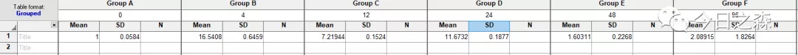

今天就写一下定量数据的处理方法。

【进入主题】
基于相对定量
基于△△Ct法
【△△Ct法原理】
这里我们只介绍△△Ct法，其特点是只依靠Ct值来计算结果，因此跑完qPCR之后的结果中除了Ct值外，其他数据几乎在后续分析和计算中是用不到的。但前提是目的基因和内参基因的扩增效率应基本一致。
1、先来了解一下什么是Ct值？
阈值循环数 Threshold cycle (Ct) 也写作Cq值，荧光信号达到荧光阈值时PCR循环数。仪器软件通常将第3-15个循环的荧光值设为基线（baseline）。阈值（threshold）一般是基线的标准偏差的10倍。
模板的Ct值与该模板的起始拷贝数的对数存在一定线性关系,起始模板量浓度越高，Ct值越小；起始模板量浓度越低，Ct值越大。PCR循环在到达Ct值所在的循环数时，刚刚进入真正的指数扩增期（对数期），此时微小误差尚未放大，Ct值的重现性较好，即相同含量的初始模板，得到的Ct值是相对稳定的。

2、计算原理及推导过程
每个循环数增加的产物的量应该是2倍。用数学式子来表达的话，就应该是2^Ct。但实际过程中增量应该是（1+e）^Ct，e就是扩增系数，或者是扩增的效率。但一般，我们都假设扩增效率为1，也就是每个循环增加一倍。
即：PCR扩增产物量=起始模板量×（1+e）^Ct；
由于这里把e默认为1；
则，PCR扩增产物量=起始模板量×2^Ct；
则，起始模板量=PCR扩增产物量/（2^Ct）；
即，起始模板量=PCR扩增产物量×2^（-Ct）。

当PCR扩增产物量达到同一水平时对应的Ct值不同，其原因在于起始模板量不同；而当样本和内参基因的PCR扩增产物量相同时，如果要算出它们对应起始模板量的比值差，就需要进行除法计算；
由，待检基因模板量=PCR扩增产物量×2^（-Ct待检）；
内参基因模板量=PCR扩增产物量×2^（-Ct内参）；

则，R=待检基因模板量/内参基因模板量=PCR扩增产物量×2^（-Ct待检）/PCR扩增产物量×2^（-Ct内参）；
则，R=2^(（-Ct待检）-（-Ct内参）)=2^（-△Ct）

故，到这里还没有结束，如果直接拿这个比值R作图，最后的结果就是层次不齐，而且是错误的，因为此时实验组和对照组不具有可比性。因为这里的R值仅仅是每个待检样本与对应内参基因的比值差。

那如何考虑这个问题呢？

很简单，对上面推导得到的所有样本和control组的2^（-△Ct），均除以control组的2^（-△Ct），即可得到2^（-△△Ct）；
好，到这里，就明白了qPCR数据分析中△△Ct法的计算原理及推导过程。
【实验设计】
假设需要研究光照时间对小麦LIGHT基因表达的影响，以光照0小时的小麦植株作为control组，以分别持续光照4、12、24、48、96 h的植物为实验组。选择GAPDH基因作为内参基因，进行qPCR实验。

需要注意，为了保证实验的可信度和准确度，应至少设置3次生物学重复（校准生物学误差），每次生物学重复至少设置3个技术性重复（为了校准操作误差）。

【数据处理】
刚才搜了一下各种各样的处理方法，最终还是归结到Excel进行数据整理，再利用GraphPad等软件进行绘图的策略。不过还是发现了一些大神开发的各种强大的处理程序，非常不错，但进行简单试用之后还是选择了更加朴素的方法。
于是，就简单写了一个Excel模板。

通过上述的推导，这里具体计算就很简单了。
下面利用GraphPad进行绘图，这里有两种策略： 

策略一：在Excel中使用函数=STDEV()先行计算标准误差，然后利用Mean+SD进行绘图。

策略二：直接使用全部（-△△Ct）值进行计算。

可以看到，两种方法最后结果是一致的。

最后需要明确的是：
Ct值的范围为15-35时为有效的。Ct值小于15，认为扩增在基线期范围内，未达到荧光阈值。理想情况下，Ct值与模板起始拷贝数的对数存在线性关系，也就是标准曲线。通过标准曲线，扩增效率为100%时，计算出基因单个拷贝数定量的Ct值在35左右，若大于35，理论上模板起始拷贝数小于1，可认为无意义。

如果觉得有用就分享给更多人吧。
先写到这里。