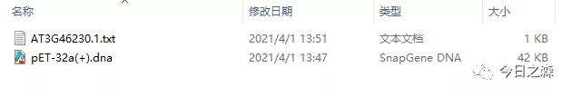
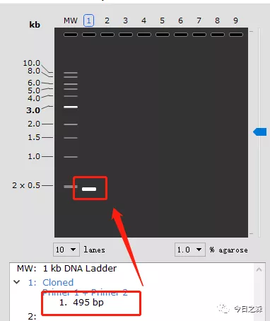

做实验嘛，时间和精力的合理分配很重要，利用有限的时间高效完成各项实验的准备工作就显得尤其必要。毕竟需要把更多的时间花在研究文献上面，然后仔细验证实验思路，最后快快的做实验。

【进入正题】
1、主题
利用SnapGene进行各类载体的构建，并模拟目的基因的扩增，载体的酶切，连接，电泳检测。

2、示例（以下涉及到的载体和序列是随便选取的，只为演示，不具备实际的意义）

下面就以pET-32a(+)和拟南芥hsp20基因AT3G46230为例进行演示。

第一步：打开SnapGene，并打开以上两个文件。

第二步：针对AT3G46230，设计选取扩增引物。这里的酶切位点就随便选取BamHI和BglII。

同样的操作，对下游引物进行选取。

这里没有加保护碱基/同源臂

第三步：对目的基因进行扩增

扩增完成。

第四步：插入目的基因。

到这一步发现有点问题，刚才随便选的两个酶切位点中的BamHI是不可用的，是因为我们的目的基因中含有BamHI酶切位点的序列。因此，通过检查后，将上面提到的BamHI替换为SalI。并对引物等进行了更新。由于重新更改和截图比较费劲，就不对上面的图片进行更改了。大家明白就行。

下面接着继续。

下面就是融合了目的基因的质粒，可以看到目的基因已经成功插入。

第五步：电泳检测

比如，这里我们对插入的目的基因进行电泳检测。

最后，保存质粒图片，或者保存为SnapGene文件，以便日后再编辑。

结束。

