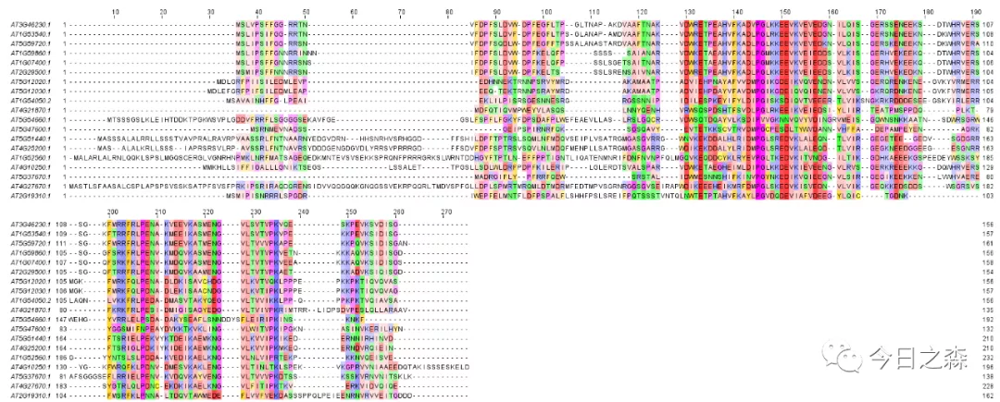

俗话说得好：人靠衣装，佛靠金装。

 科研作图亦是如此，随着各类软件的发展和科研工作者的审美不断提高。
 如果不给你的图片做个“美妆”还能不好意思拿出去见人，更不好意思放在你的paper中。
 接下来就介绍一个软件，用以对对序列比对结果进行美化和编辑，可以让你的多序列比对图片瞬间高大上。
 从此你做的图就是颜值担当！
 
   今天的主角是jalview  
   
【进入正题】 

1、软件下载安装 https://www.jalview.org/  

该软件支持多种操作系统，各位根据需要自行下载安装即可。安装方法与普通软件的安装方法相同，一路next即可。
 但该软件依赖于java，因此首先需要安装java。
 另外，由于该软件可与EML、PDB等网站互联，因此在使用web功能时需要联网。
 
 2、软件的功能  
 
 下图所见即为该软件的功能展示，是不是很强大。
 
 
 
 3、软件的使用  
 
 打开软件后，就会自动弹出这些界面，这是该软件的内置信息，目的就是为了展示该软件的主要功能及可视化效果，载入我们自己的序列时，全部关闭即可。可以通过下图大致看到，可以实现以下功能：  
 
 对多序列比对结果进行高颜值的着色； 
 显示保守区间和比对质量； 
 可对序列进行快速编辑； 
 对选中的序列构建进化树； 
 显示选中序列的蛋白结构或二级结构，等。
  
  
  
下面开始简单操作一下。由于该软件操作极其简单，就不一一进行演示了，直接出一张简单编辑之后的图片。
 这里使用之前示例中的Athsp20序列。
 
   
 总之，这里只是进行了简单编辑，总体来看颜值还不错。
   具体的功能就很多了，大家可以自行摸索。
 画出满意的figure。