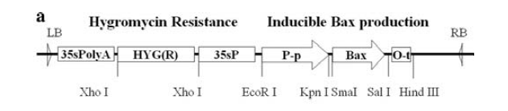
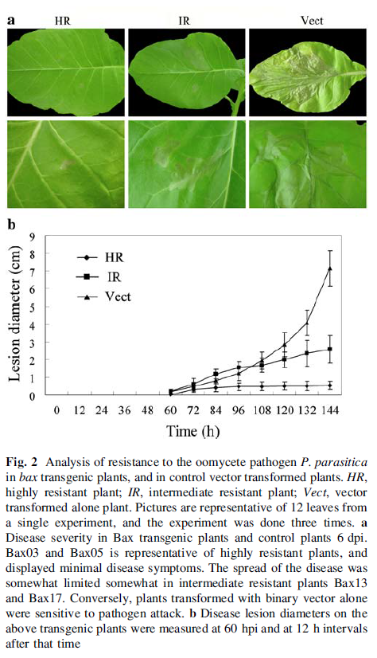
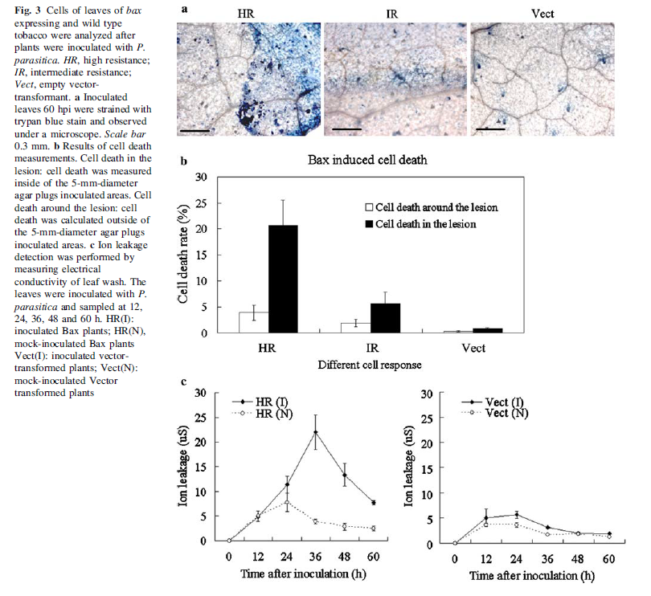
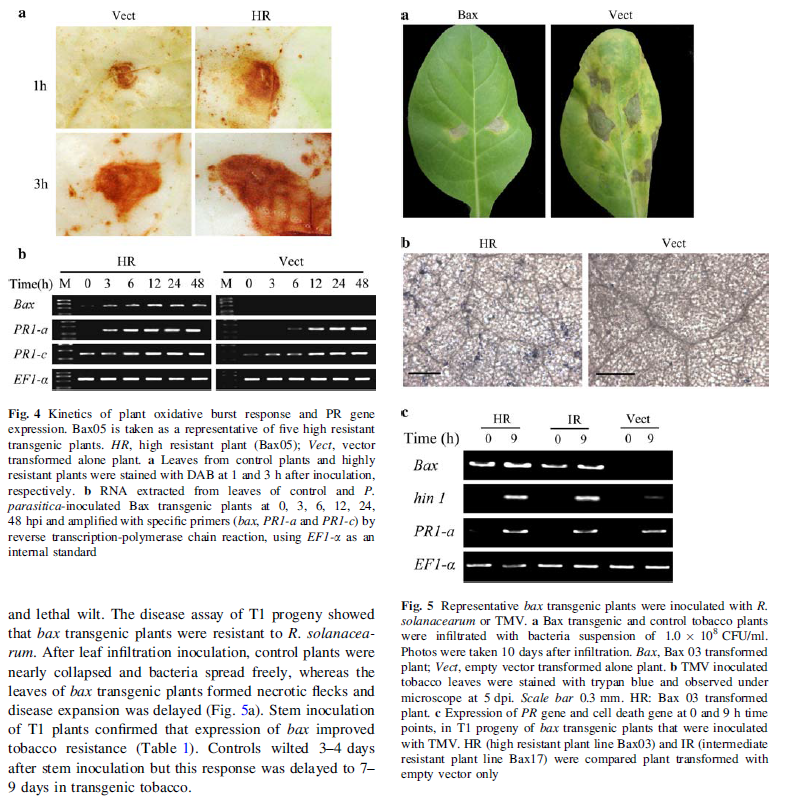

## 森言森语 
>做出基本判断和抉择之后要坚信自己。      

常利用农杆菌介导的瞬时表达系统，在本氏烟（*Nicotiana benthamiana*）中验证effector是否能够诱导/抑制细胞程序性死亡（programmed cell death，PCD）。那这一过程的主要机制是什么呢？    
### 小综述    
PCD在植物免疫和抵御病原侵染等方便发挥作用。但植物中缺乏动物细胞所具有的PCD相关基因，不过植物和动物在PCD过程中的一些方面具有类似的生化状态。

哺乳动物BcI-2家族是一组保守的细胞存活和死亡关键调节因子，bax是该家族的成员之一，是PCD的正调节因子。早前有研究人员推测该家族基因通过在线粒体外膜中形成通道，以释放细胞色素c，随后通过未知的机制（目前可能已知了，我没有新进的文献。）触发复杂的PCD途径诱导细胞死亡。    >细胞死亡的大致特征是：    
>- 细胞收缩 
>- 染色质浓缩 
>- 质膜褶皱 
>- 细胞核碎裂 
 
而植物在受到病原体侵染后会激活防御系统，从而限制病原体在侵染部位的扩展，即过敏反应（HR）。HR通常包括PCD的激活。这一过程中植物细胞具有和哺乳动物细胞类似的细胞特征和生化状态。 
 
但在随后的研究中，并没有在植物中发现类似动物细胞中调控细胞死亡的BcI-2家族基因的同源基因。

这就奇怪，于是，有研究者在植物中异源表达了调节动物细胞死亡的BcI-2家族蛋白，发现过表达某些基因后可以抑制PCD，而有些基因的过表达则促进PCD。     

其中有研究表明，由携带bax的病毒载体诱导的植物细胞死亡和携带N基因的烟草植物中有烟草花叶病毒（Tobacco mosaic virus,TMV）诱导的坏死表型非常相似。即：BAX靶向线粒体，并将线粒体的形状从杆状变为圆形；叶绿体膜被破坏，并导致其内容物泄露；液泡被破坏；BAX异源表达还引发局部PCD，并诱导植物防御基因的表达，诱导与系统获得性（systemic acquired resistance，SAR）相关的一些基因。
### BAX诱导的细胞程序性死亡原理  
南京农业大学王源超教授团队于2008年发表的文章《**Mammalian pro-apoptotic bax gene enhances tobacco resistance to pathogens**》对BAX诱导的PCD进行了探究。     

他们测试了来自水稻的苯丙氨酸解氨酶启动子（PALpro）调节bax表达的有效性。   PALpro是一种有压力诱导的条件启动子，包括创伤、TMV、bacteria、fungi等的攻击。     

转基因载体  
   
   
   
  
**reference**    
Dong S, Zhang Z, Zheng X, Wang Y. Mammalian pro-apoptotic bax gene enhances tobacco resistance to pathogens [published correction appears in Plant Cell Rep. 2011 Aug;30(8):1571. Suomeng, Dong [corrected to Dong, Suomeng]; Zhengguang, Zhang [corrected to Zhang, Zhengguang]; Xiaobo, Zheng [corrected to Zheng, Xiaobo]; Yuanchao, Wang [corrected to Wang, Yuanchao]]. Plant Cell Rep. 2008;27(9):1559-1569. doi:10.1007/s00299-008-0554-5