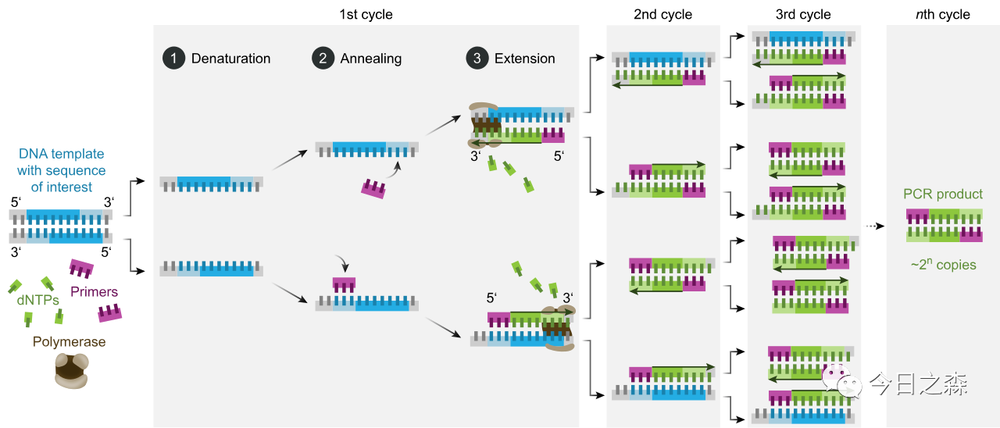
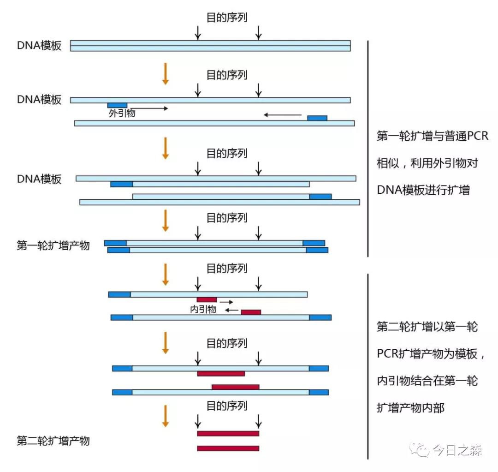
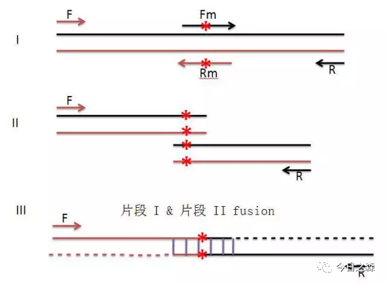
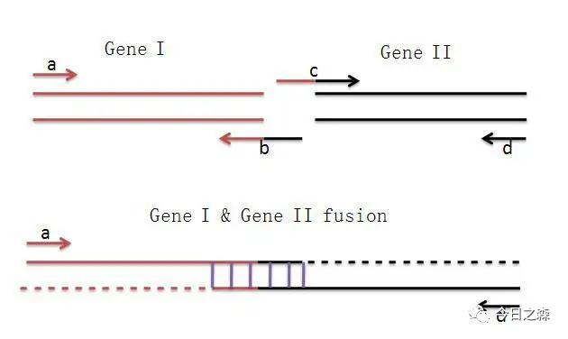

最早接触PCR是在做科创和本科毕业论文相关实验的时候，通过扩增野生型菌株和突变体菌株的某个基因，

然后通过AS-PCR方法，设置温度梯度，筛选一对能够区别S和M菌株的特异性引物。

那个时候对PCR有一个大概的影响，其实在操作方面是没什么问题的。但是仔细想起来，和其他实验一样，都是一知半解，对PCR亦是如此。

因此，我觉得有必要重新学习一下PCR相关的各种技术和原理。

【进入正题】

PCR (polymerase chain reaction)聚合酶链式反应，又称体外DNA扩增技术，在1985年由美国Cetus公司的Kary Mullis首创，可以将微量目的DNA片段扩增一百万倍以上。

Kary Mullis本人因此获1993年诺贝尔化学奖。

前面分享过PCR之歌，这里在系统整理PCR相关知识之前，重温一下。

一、PCR的原理

在DNA聚合酶催化下，以母链DNA为模板，以特定引物为延伸起点，通过变性、退火、延伸等步骤，

体外复制出与母链模板DNA互补的子链DNA的过程。

聚合酶链式反应用于扩增一小段已知的DNA片段，可能是单个基因，或者仅仅是某个基因的一部分。与活体生物不同的是，

PCR只能复制很短的DNA片段，通常不超过10kbp。DNA是双链分子，因此用互补DNA双链的构造单位（核苷酸）来度量其大小，

单位为碱基对（base pair, bp）。

二、PCR反应成分

三、PCR反应基本步骤

一般的聚合酶链式反应由20到35个循环组成，每个循环包括以下3个步骤：

变性(Denaturation)：

利用高温（93-98℃）使双链DNA分离。高温将连接两条DNA链的氢键打断。

在第一个循环之前，通常加热长一些时间以确保模板和引物完全分离，仅以单链形式存在。

该步骤时间1-2分钟，接下来PCR仪就控制温度进入循环阶段。

退火或称接合,复性(Annealling)：

在DNA双链分离后，降低温度使得引物可以结合于单链DNA上。

此阶段的温度通常低于引物熔点5℃。错误的退火温度可能导致引物不与模板结合或者错误地结合。该步骤时间1-2分钟。

延伸(Extension)：

DNA聚合酶由降温时结合上的引物开始沿着DNA链合成互补链。此阶段的温度依赖于DNA聚合酶。

该步骤时间依赖于聚合酶以及需要合成的DNA片段长度。传统的Taq估计合成1000bp/min、较新的Tbr（来自于嗜热菌Thermus brockianus）约40秒、

商业公司生产的融合型聚合酶仅需约10-15秒。

四、PCR反应条件优化

1、变性温度和时间：

保证模板DNA解链完全是保证整个PCR扩增成功的关键。

加热90~95°C, 30~60s，再复杂的DNA 分子也可变性为单链。

温度过高或高温持续时间过长，可对Taq酶活性和dNTP分子造成损害。

2、复性温度和时间:

PCR扩增特异性取决于复性过程中引物与模板的结合。

复性温度越高，产物特异性越高。复性温度越低，产物特异性越低。

需根据引物的Tm值具体设定。

3、延伸温度和时间:

一般位于Taq酶最适作用温度70~75°C之间。引物小于16个核苷酸时，过高的延伸温度不利于引物与模板的结合，可以缓慢升温到70~75°C。

延伸反应时间，可根据待扩增片段的长度而定，小于1kb, 1min足够；大于1kb需加长延伸时间。Taq酶可根据1kb/min增加时间。

这里需要注意，延伸时间过长可能出现非特异扩增。因此需要设置恰到好处的延伸时间。

4、循环数:

其他参数选定后，PCR循环次数主要取决于模板DNA的浓度。

理论上说20〜25次循环后，PCR产物的积累即可达到最大值，实际操作中由于每步反应的产率不可能达到100%，

因此不管模板浓度是多少，20~30次是比较合理的循环次数。循环次数越多，非特异扩增增加。

五、PCR延伸技术

由PCR延伸而来的技术很多，这里只介绍日常实验中常用到的几种。

1.touchdown PCR

降落PCR，主要用于PCR的条件的优化。在许多情况下引物的设计使得PCR难以进行，例如特异性不够易错配等。

退火温度过高会使PCR效率过低，但退火温度过低则会使非特异扩增过多。

因此，前面几个循环的起始退火温度设定为比引物的最高熔解温度（Tm）再高几度。前几循环温度逐渐下降至设定的最终Tm。

通过较高温度获得特异性匹配较高的模板后，再以较低温度高效率扩增。

2.RT-PCR

逆转录-聚合酶链反应(Reverse Transcription-Polymerase Chain Reaction，RT-PCR)的原理是：

提取组织或细胞中的总RNA，以其中的mRNA作为模板，采用Oligo（dT）或随机引物利用逆转录酶反转录成cDNA。

再以cDNA为模板进行PCR扩增，而获得目的基因或检测基因表达。

3.real-time PCR/quantitative PCR

实时荧光定量PCR技术，是指在PCR反应体系中加入荧光基团，利用荧光信号积累实时监测整个PCR进程，

最后通过标准曲线对未知模板进行定量分析的方法。

4.nested PCR

先用低特异性引物扩增几个循环以增加模板数量，再用高特异性引物扩增。

5.SOE PCR

重叠延伸PCR分为2种：用重叠延伸PCR做定点突变 和 用重叠延伸PCR做序列缺失突变，即重叠延伸PCR技术(gene splicing by overlap extension PCR,简称SOE PCR)

5.1 用重叠延伸PCR做定点突变（由于原理简单，直接上图）

该步一定要用pfu酶，不能用Taq酶，因为Taq酶容易在PCR产物末端加A，会造成产物移码突变。

5.2 用重叠延伸PCR做序列缺失突变

6.高GC含量PCR

具有高GC含量（>65%）的DNA模板由于G和C碱基间的强氢键影响，比较难以扩增。

富含GC的序列同时也涉及二级结构。因此，富含GC的序列可导致DNA聚合酶沿模板扩增时“卡顿”并干扰DNA合成。

为了扩增高GC含量的片段，双链模板必须解离，以便引物与模板结合，并使DNA聚合酶能够读取到序列。

为了克服强GC相互作用，最常用的方法是使用DMSO等PCR添加剂或辅助溶剂来帮助DNA变性。

然而，这些试剂通常会降低引物的 Tm，所以退火温度也需进行相应的调整。

高合成能力的DNA聚合酶由于与模板的结合能力更强，有利于完成高GC含量PCR。

超高热稳定性DNA聚合酶也有利于高GC含量PCR，因为较高的变性温度（如，使用98°C代替95°C）可能会促进双链解离和PCR扩增。

7.AS-PCR

等位基因特异性PCR（ allele specific PCR，AS-PCR ），是指利用引物与模板之间的碱基错配可以有效地抑制PCR反应，

进而达到模板区分（等位基因区分）的目的。

由于PCR过程中引物延伸是3'端开始的，所以3'末端的碱基对引物的延伸来说处于至关重要的位置。

如果这个碱基与模板互补，则引物能不间断延伸，PCR可以正常进行，得到特定长度扩增带，反之，则不能延伸。

所以只要将与正常等位基因所不同的那个突变碱基安排在引物3'最末端，当用某一含突变序列的引物进行PCR时，如果得到特异条带，

表明被测基因含有该种突变。没有特异扩增带出现，则表示没有这种突变。

注意：这里由于仅仅利用了引物3'末尾碱基的错配，因此需要摸索一个合适的Tm，才能达到检测目的。

【Reference】

Mullis, Kary B. et al. "Process for amplifying, detecting, and/or-cloning nucleic acid sequences" 美国专利第4,683,195号