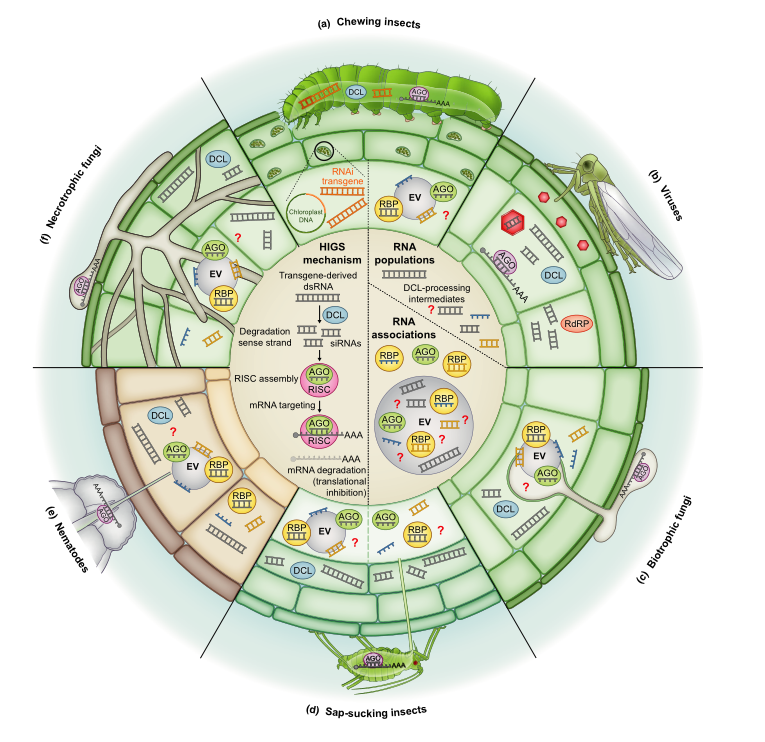

## 回顾    
2010年，寄主介导的基因沉默（host-induced gene silencing，HIGS）这一术语被Nowara等人提出。

>由于白粉病真菌是专性的生物营养性病原体，缺乏诱变和转化技术为研究病原菌致病性和毒力基因的直接功能证据。Nowara等人的研究表明，双链RNA或反义RNA靶向真菌转录物在大麦和小麦中的积累影响白粉病真菌的发育。

实际上，早在2007年，Mao等人关于棉铃虫P450的研究，便是后来的HIGS。
>Mao等人从棉铃虫（***Helicoverpa armigera***）中鉴定出一个细胞色素P450基因（CYP6AE14），该基因使这种食草动物能够耐受棉花代谢产物**棉酚**的抑制浓度。CYP6AE14在中肠高度表达，当食物中含有棉酚时，其表达与幼虫生长相关。当幼虫被喂食表达CYP6AE14特异性双链RNA（dsRNA）的植物材料时，中肠中该转录物的水平降低，幼虫生长受阻。

## HIGS机制 
HIGS机制的VIGS类似，即RNAi。    
  在真核细胞内，外源或内源的双链RNA（double-stranded RNA,dsRNA）或RNA形成的发夹结构被Dicer蛋白识别后，切割成21-24nt的小干扰RNA（small interfering RNA，siRNA），随后siRNA和Argonaute（AGOs）蛋白结合形成RNA诱导沉默复合物（RISC）。RISC特异的识别细胞内同源的目的基因mRNA，并对其进行切割，从而干扰目的基因的表达。

 因此，在真核细胞内表达目的基因的dsRNA，或者将体外表达或合成的dsRNA或siRNA导入真核细胞，都可能沉默目的基因。
 
 类似的，如果在寄主植物细胞内表达靶向病原基因的dsRNA，就可以实现对病原基因的干扰，从而抑制病原菌的生长和扩展。
 
 HIGS技术以病原菌生长发育和参与致病的重要基因作为靶点，通过在寄主植物中表达与病原菌靶基因互补的RNA分子，再经植物细胞加工形成siRNA，当病原菌侵染寄主植物时，寄主植物能够将siRNA转运到病原菌细胞内，特异性识别病原菌靶基因的mRNA，导致其降解，从而干扰靶基因的转录和翻译，进而影响病原菌的正常生长发育，降低病害的发生发展。
 
 Aline Koch和Michael Wassenegger综述了HIGS技术在过去二十年的发展和应用。
 
 ## reference 
1. Mao, YB., Cai, WJ., Wang, JW. et al. Silencing a cotton bollworm P450 monooxygenase gene by plant-mediated RNAi impairs larval tolerance of gossypol. Nat Biotechnol 25, 1307–1313 (2007). https://doi.org/10.1038/nbt1352 
2. Daniela Nowara, Alexandra Gay, Christophe Lacomme, Jane Shaw, Christopher Ridout, Dimitar Douchkov, Götz Hensel, Jochen Kumlehn, Patrick Schweizer, HIGS: Host-Induced Gene Silencing in the Obligate Biotrophic Fungal Pathogen Blumeria graminis    , The Plant Cell, Volume 22, Issue 9, September 2010, Pages 3130–3141, https://doi.org/10.1105/tpc.110.077040 
3. Koch A, Wassenegger M. Host-induced gene silencing - mechanisms and applications. New Phytol. 2021;231(1):54-59. doi:10.1111/nph.17364