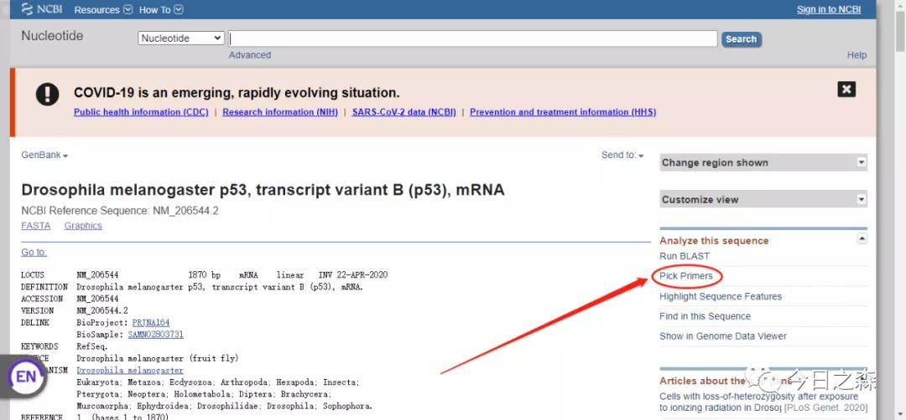

原创作者名称变更说明

之前使用过Reappear和Gleason，以后的推文都使用G.S. Zhao，其实这三个名称都是我。

【进入正题】

前面提到的几个探究蛋白互作相关的实验，其实第一步都需要构建合适的质粒，那么就少不了设计靠谱的引物了。

通常来说，引物的设计需要遵守一些基本的原则。这些原则很细，很多，也很繁琐。但实际上对于常规的引物，并不需要考虑太多，达到实验目的即可，

更多的情况下需要灵活选择。

一般来说，引物设计需要遵循以下原则：

1. 引物的长度一般为15-30 bp，常用的是18-27 bp，但不应大于38，因为过长会导致其延伸温度大于74℃，不适于Taq DNA聚合酶进行反应。

2. 引物序列在模板内应当没有相似性较高，尤其是3’端相似性较高的序列，否则容易导致错配。引物3’端出现3个以上的连续碱基，如GGG或CCC，也会使错误引发机率增加。

3. 引物3’端的末位碱基对Taq酶的DNA合成效率有较大的影响。不同的末位碱基在错配位置导致不同的扩增效率，

末位碱基为A的错配效率明显高于其他3个碱基，因此应当避免在引物的3’端使用碱基A。另外，引物二聚体或发夹结构也可能导致PCR反应失败。

5’端序列对PCR影响不太大，因此常用来引进修饰位点或标记物。

4. 引物序列的GC含量一般为40-60%，过高或过低都不利于引发反应。上下游引物的GC含量不能相差太大。

5. 引物所对应模板位置序列的Tm值在72℃左右可使复性条件最佳。Tm值的计算有多种方法，如按公式Tm＝4(G+C)＋2(A+T)。

6. ΔG值是指DNA双链形成所需的自由能，该值反映了双链结构内部碱基对的相对稳定性。应当选用3’端ΔG值较低（绝对值不超过9），

而5’端和中间ΔG值相对较高的引物。引物的3’端的ΔG值过高，容易在错配位点形成双链结构并引发DNA聚合反应。

7. 引物二聚体及发夹结构的能值过高（超过4.5kcal/mol）易导致产生引物二聚体带，并且降低引物有效浓度而使PCR反应不能正常进行。

8. 对引物的修饰一般是在5’端增加酶切位点，应根据下一步实验中要插入PCR产物的载体的相应序列而确定。

但是在实际设计过程中，往往很难同时满足以上条件，因此只需要在设计引物时尽可能满足即可，没必要太过纠结。

同时需要注意，各种模板的引物设计难度不一，具体情况需要具体看待。有的模板本身GC含量偏高或偏低，

导致找不到各种指标都十分合适的引物；在用作克隆目的的PCR因为产物序列相对固定，引物设计的选择自由度较低。在这种情况只能退而求其次，尽量去满足条件。

下面主要介绍以下两方面的引物设计。

1 点突变引物设计

2 qPCR引物设计

（常规引物的设计思路在《实验技术（1）——载体构建相关》已经提到，这里不再重复。）

1 点突变引物设计

在蛋白质功能研究过程中常常对其关键的酶活位点、修饰位点进行突变，通过点突变来研究基因中发挥关键功能的是哪一个结构域，

甚至具体到哪一个氨基酸。因此就需要设计点突变引物。

点突变主要的原则就是通过尽量突变较少的碱基数目而使氨基酸发生更改。由于氨基酸密码子第三位具有简并性，一般不需要进行突变，因此至多突变两个碱基即可。

1.1单点突变引物设计

比如，将下图中的Ser突变为Ala。

首先，查询编码Ala的密码子：为GCA/GCT/GCG/GCC，根据改动最小原则，我们选择将其突变为GCC，则只需要改动1个碱基，即TCC→GCC。

设计引物（分两种情况）：

情况一：构建点突变质粒

只需下面这一对引物即可。

F-S241A：TGTACACATTGTCACGGACGTACCCGCCGT

R-S241A：ACGGCGGGTACGTCCGTGACAATGTGTACA

可以看到黄色部分为需要突变的氨基酸，红色的碱基为突变碱基，两边各延长一部分完全与模板互补配对的碱基。

但是发现两条引物完全互补配对，看似违反了前面所讲的原则，但实际上是针对质粒点突变精妙的设计。

两条引物有一定几率与模板匹配，此时便会按5‘-3’方向完整扩增一圈整个环状质粒，最终形成突变质粒的构建。

情况二：只对目的基因进行点突变

则除了需要情况一中的两条引物，还需要在目的基因两端选取F和R。如下图：

1.2同时对多个位点进行点突变

针对单点突变，手动选取即可完成，但对于多位点突变就不能蛮干了。这里分享一个在线点突变引物设计的网址：

https://www.agilent.com/store/primerDesignProgram.jsp

该网站可以设计单点和多点突变引物以及删除或者插入一段DNA序列（ 插入时只能插入小的DNA片段）。可以同时设计针对7个氨基酸的突变引物。

进入页面：

参数说明：

比如，我们对以下3个位点进行点突变。

从结果可以看到引物的长度、Tm值及引物与模板相互匹配的序列

1.3缺失一段序列

比如缺失下图中67-114之间的序列，（注意：第67位和114位这两个氨基酸不会被删除，实际删除66-113这段氨基酸序列）。

小结：一般在单点突变和缺失一段序列时，成功率比较高；多点突变时可能就需要多次尝试并检测了。

2 qPCR引物设计

Q：qPCR引物设计的问题点：

A：SYBR Green与双链DNA结合后会产生荧光，如果反应体系中有非特异性扩增或者引物二聚体存在，也将被检测到，导致实验结果的不准确。

因此设计合适的qPCR引物就很关键。

qPCR引物设计的一般原则：

引物应在核酸系列保守区内设计并具有特异性。

扩增产物长度在80-150 bp。最长不要超过300 bp。

产物不能形成二级结构。

引物长度：一般在17-25碱基之间，上下游引物不宜相差太大。

引物自身避免形成发卡结构。

引物之间避免形成引物二聚体。

引物 G+C含量在40%～60%之间，45-55％最好。

引物Tm值在58-62度之间，上下游引物Tm值不宜相差太大，最好不要超过5度。

其实这里qPCR引物的设计和常规PCR的设计也是大同小异。和常规引物设计一样，并不能死磕原则，灵活选择更为重要。

这里可以使用以下软件和在线网站进行设计：

1.Primer Premier 5.0

设计方法和常规引物设计一样，只需根据实验需求设置几个必要参数即可。这里不进行演示。

2.NCBI Primer blast：

https://www.ncbi.nlm.nih.gov/tools/primer-blast/

3.Primer3：

https://bioinfo.ut.ee/primer3-0.4.0/

下面对NCBI Primer blast和Primer3进行简单介绍。

NCBI Primer blast

同样，我们选择P53这个基因。点击Pick Primer进入NCBI Primer blast界面。

可以看到，上一步选择的p53序列已经加载进来。

接下来看一下界面中几个重要的参数设置。

结果如下：

最后，选择最优引物即可。

Primer3

Primer3属于傻瓜式操作，各参数已自动设定，基本无需更改，粘贴序列后直接提交即可。

但这里需要思考一个问题：

是否排名第一的引物对一定最优呢？不一定。由于这些引物是未考虑非特异性扩增的。

因此在得到候选引物对后，最好还是灵活选择。以便得出最优的引物对，确保实验的准确性。

除了上述在线网址外，给大家推荐以下软件和在线网址，助力解决点突变、qPCR等引物设计的各种问题。

具体的使用问题各位可以自行摸索，都很简单，基本上打开就可以使用

1.BioXM

2.http://www.bioinformatics.org/primerx/index.htm

3.https://biodb.swu.edu.cn/qprimerdb/

（qPCR引物数据库qPrimerDB，收录了包括66种重要植物（拟南芥、水稻、玉米、大豆、马铃薯等）等在内的147个物种共3331426个基因的51091785对qPCR引物。）

