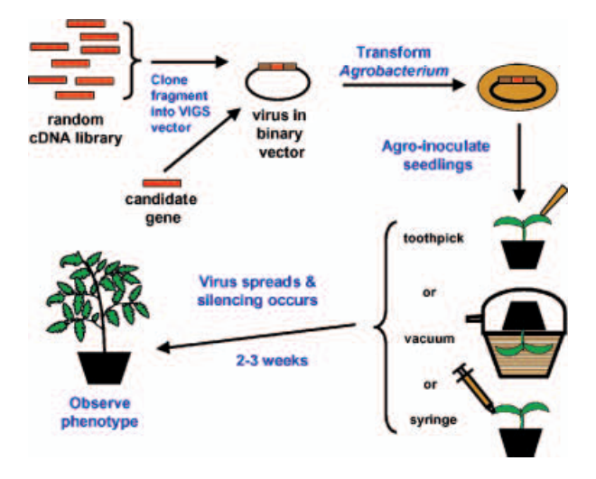
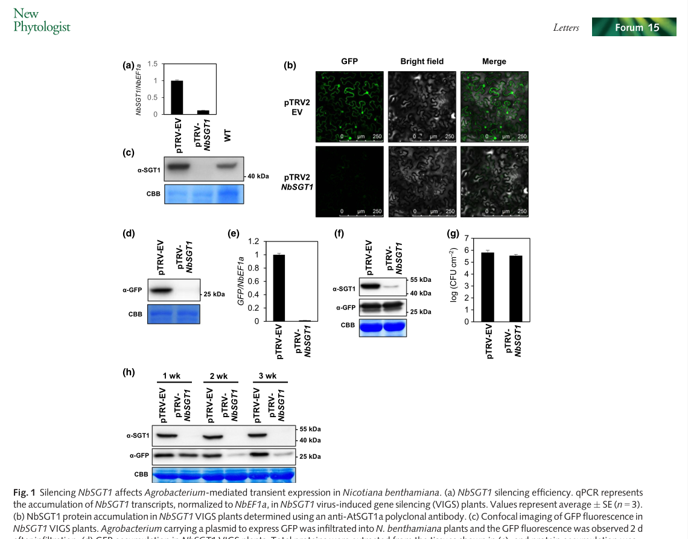

## 回顾
1995年，Kumagai等人通过携带几乎相同序列的重组病毒发现了内源性基因的转录后基因沉默（PTGS）。   

1997年，**VIGS**这一术语最早被Van Kammen用于描述植物受病毒侵染后的症状恢复现象。

1999年，Baulcombe认识到，由于VIGS允许通过讲解特定基因的转录本来有针对性地下调该基因，VIGS将被作为基因功能研究的潜力巨大。   

2004年，Burch-Smith通过使用重组病毒来沉默植物内源基因，此后，VIGS作为一种反向遗传学技术被研究者广泛使用。

**病毒诱导的基因沉默**（virus induced gene silencing，VIGS）是指携带目的基因片段的病毒侵染植物后，随着病毒的复制和转录而特异性的诱导序列同源基因mRNA降解或被甲基化等修饰，从而引起植物内源基因沉默、引起表型或生理指标变化，进而根据表型变异研究目标基因的功能。

VIGS是根据植物对RNA病毒防御机制发展起来的一种用以表征植物基因功能的基因转录技术，其内在的分子基础可能是转录后基因沉默(post-transcript gene silence)。

与传统的基因功能分析方法相比，VIGS能够在侵染植物当代对目标基因进行沉默和功能分析；无需开发稳定的转化子，并且具有沉默单个或多个基因家族成员的潜力。

因此，VIGS一经建立，即被视为研究植物基因功能的强有力工具，得到了深入的研究和广泛应用，已用于烟草、番茄、小麦、水稻等植物的抗病反应、生长发育以及代谢调控的功能基因研究。

## 沉默机制
基因沉默在生物中普遍存在，表现在抵御病毒、转座子等外来核酸的入侵，识别并抑制外源基因表达，维持生物基因组稳定性等。   

VIGS 作为基因沉默的特殊形式，是植物抗病毒侵染的一种自然机制。当病毒或携带cDNA 的病毒载体侵染植物后，在复制与表达过程中通常会形成双链RNA（Double stranded RNA，dsRNA）形式的中间体。   

dsRNA 作为基因沉默关键激发子，首先在细胞中被类似RNase Ⅲ家族特异性核酸内切酶Dicer 类似物（如DCL4）切割成21 ~ 24 nt 的小分子干扰RNA（Small interfering RNA，siRNA）。   

siRNAs 在植物细胞内被依赖RNA 的RNA 聚合酶1（RNA-dependent RNA polymerase 1，RDR1）、RDR2 或RDR6进一步扩增，并以单链形式与Agronaute1（AGO1）蛋白等结合形成RNA 诱导的沉默复合体（RNA-induced silencing complex，RISC），RISC 特异地与细胞质中的同源RNA 互作，导致同源RNA 降解，从而发生转录后水平的基因沉默（Post-transcriptional gene silencing，PTGS）发生转录水平的基因沉默（Transcriptional gene silencing，TGS）。

VIGS 可以分为两种类型，即转录后水平的基因沉默（PTGS）和转录水平的基因沉默（TGS）。

## 影响VIGS效率的因素及缺陷分析
- 插入片段与靶基因的同源性显著影响VIGS 的效率    

>由于VIGS 的作用机制基于核苷酸序列同源性，两者序列同源性越高，基因沉默效果越好，基因片段如果选择不当可能会造成基因沉默的“脱靶”，从而得不到有效的沉默表型。    

>疑惑：植物中很多基因都以家族形式存在，尤其对于小麦基因组而言，基因家族普遍庞大，家族成员往往在几十到几千不等，家族内各成员的序列又具有很高的相似性。所以，如果只沉默基因家族中的某个特定基因，则必须在其特异序列上选取靶基因片段，这一步对插入序列的选择就得仔细；如果要沉默基因家族内的多个基因，则必须选取基因家族的共有保守序列，以避免不同基因之间的功能互补而达不到良好的沉默效果。   

- 靶基因片段的长度   
>插入病毒载体的基因片段长度应在200~350 bp之间。过短则有可能由于不能满足特异性匹配的要求而导致沉默掉非靶标基因；过长则有可能造成插入片段的丢失，或失去系统侵染能力。     
- 靶基因片段的方向    
>一般而言，靶基因片段反向插入VIGS 载体比正向插入诱导的基因沉默效率要高。但不绝对。     
- 环境温度      
>一般情况下，高温环境会导致植物体内病毒含量显著降低，基因沉默的效率亦明显降低；而在较低的温度条件下，病毒的含量和基因沉默的效率都显著地上升。    
- vigs体系中的PDS是什么？       
>八氢番茄红素脱氢酶（Phytoene desaturase，PDS）是类胡萝卜素合成途径中的一个关键酶，当PDS 表达受阻时，植物便丧失了类胡萝卜素的光保护作用，从而呈现出白化效应。也常以此作为接毒成功与否的参照。

## 展望   
**VIGS作为快速表征感兴趣基因表型的筛选技术，对特定物种病毒载体的改造应该值得被重视。**

`关于VIGS技术的一篇文献，我觉得很可。`   

2019年，中科院上海植物逆境中心 Alberto P.Macho 课题组在 NbSGT1-VIGS 实验过程中发现：利用 TRV 沉默系统产生的 NbSGT1-VIGS 的本氏烟中，NbSGT1 能够有效被沉默，然而通过农杆菌介导的瞬时表达系统会受到影响，例如 GFP 蛋白不能有效被转录与表达 (Fig.1)。    

而通过相似的方法沉默其他免疫相关蛋白，如 NbEDS1, NbNDR1 不会产生类似的效果，此外前期文献报道，SGT1-VIGS 烟草中 SA 含量会升高，而且本文中也报道 NbSGT1-VIGS 烟草中 PR1 表达量会升高，表明持续沉默 SGT1 可能会影响到 SA 介导的信号转导，从而影响农杆菌介导的异源蛋白表达。    

研究人员还发现，NbSGT1-VIGS 一周后，NbSGT1 能够有效被沉默，而此时农杆菌介导的外源蛋白表达不明显受影响。    

`该研究工作表明，在利用 NbSGT1-VIGS 本氏烟进行农杆菌介导的瞬时表达时，需要通过 westernblot 检测蛋白表达，从而得出相关结论。`
## 【Reference】    
1. Burch-Smith TM, Anderson JC, Martin GB, Dinesh-Kumar SP. Applications and advantages of virus-induced gene silencing for gene function studies in plants. Plant J. 2004 Sep;39(5):734-46. doi: 10.1111/j.1365-313X.2004.02158.x. PMID: 15315635.

2. Yu G, Xian L, Sang Y, Macho AP. Cautionary notes on the use of Agrobacterium-mediated transient gene expression upon SGT1 silencing in Nicotiana benthamiana. New Phytol. 2019 Apr;222(1):14-17. doi: 10.1111/nph.15601. Epub 2018 Dec 11. PMID: 30451288.

3. 宋震,李中安,周常勇.病毒诱导的基因沉默(VIGS)研究进展[J].园艺学报,2014,41(09):1885-1894.