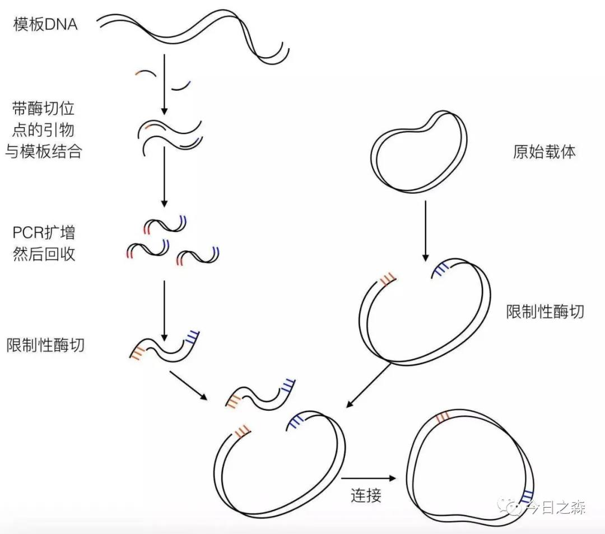
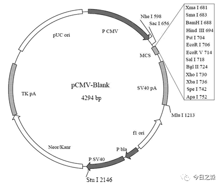
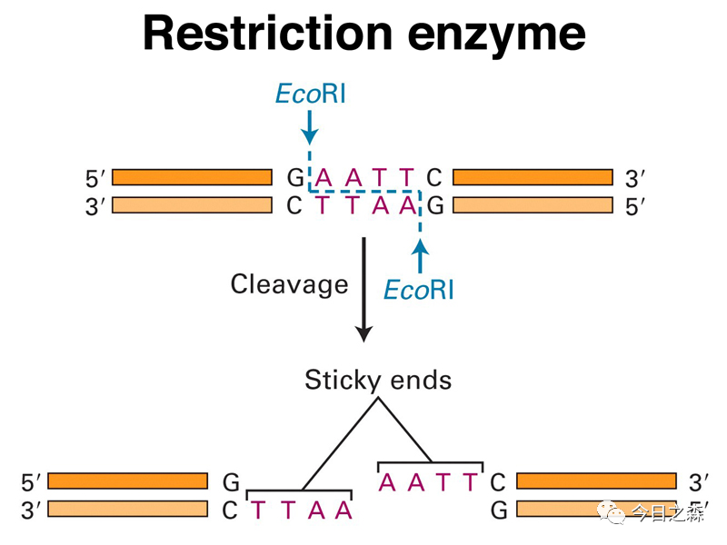
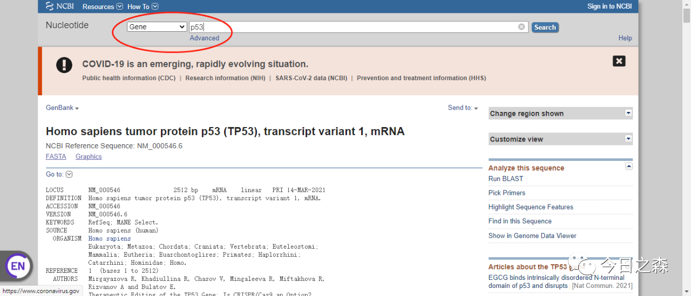
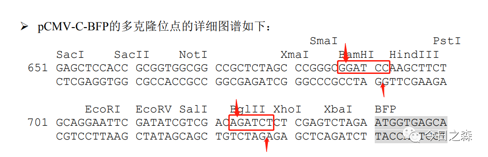
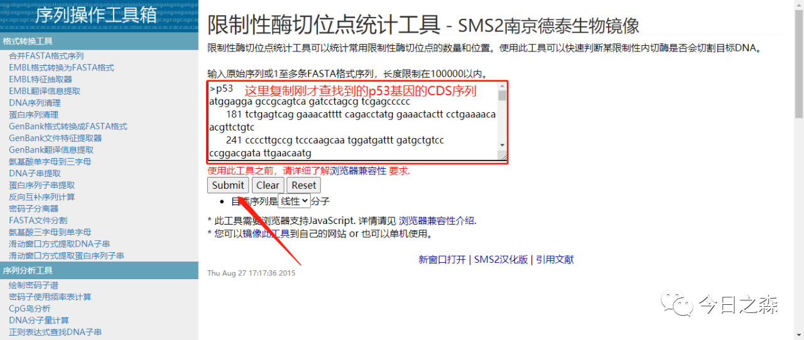
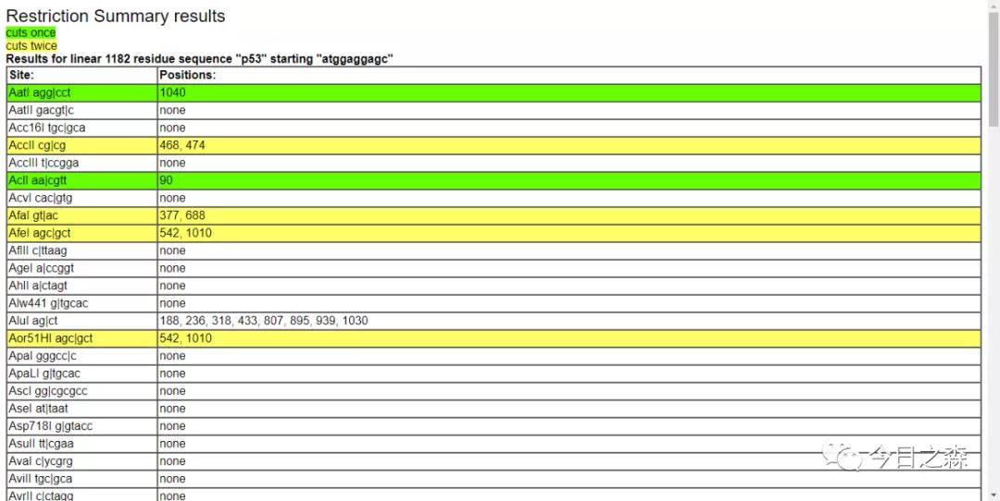
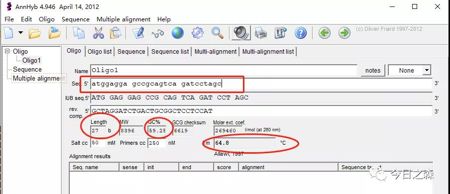
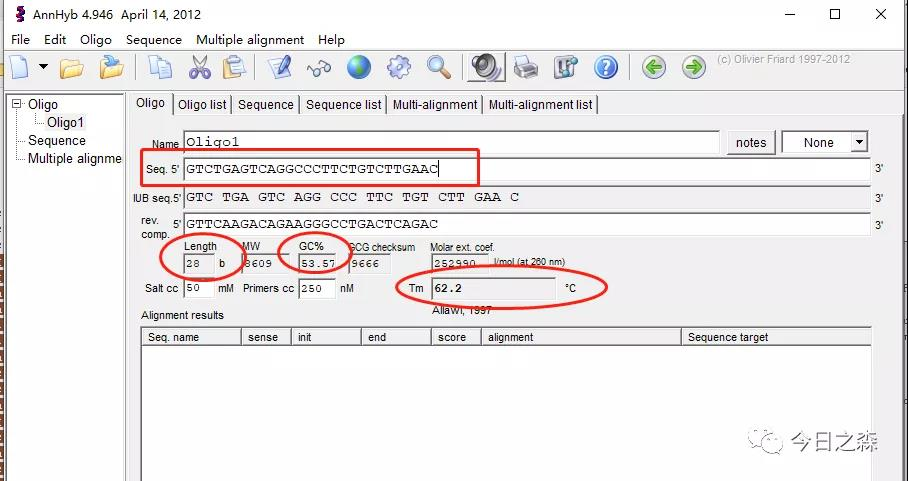
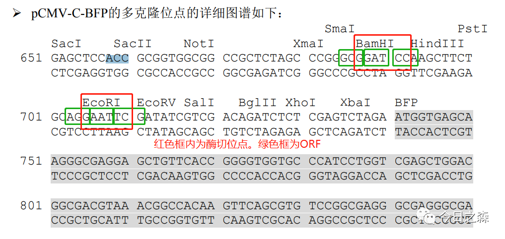

常规载体构建原理及流程较为简单，具体操作也比较容易。这里进行简单总结，并对几点需要注意的点进行说明。

原理依赖于限制性核酸内切酶，DNA连接酶和其他修饰酶的作用，分别对目的基因和载体DNA进行适当切割和修饰后，将二者连接在一起，再导入宿主细胞，

实现目的基因在宿主细胞内的正确表达。

前面提到的几个验证蛋白互作的实验，第一步就是要构建对应的载体。

【进入正题】

同样，直接看图了解质粒构建的基本流程。

了解了大致流程后，逐一了解一下载体构建过程中需要用到的一些材料。

图片来源：https://www.beyotime.com/Manual/D2621%20pCMV-C-BFP.pdf

下面就以pCMV-Blank为例展开。

从质粒图谱可以看到这几个主要的组成部分。

p CMV启动子（以及其他的启动子SV40、bla、T7……）：高效率启动基因表达。

MCS（Multiple cloning site）：多克隆位点，外源基因的插入。

TK pA（以及SV40 polyA信号）：转录终止，给mRNA添加polyA防止降解。

neomycin（G418）/kanamycin/ampicillin/puromycin resistance：用于细菌转化/细胞转染后的筛选。

这也就是为什么在做转化过程中，有时候要加kan，有时候要加Amp。

实际上我们在操作过程中主要还是关注MSC和抗性标签这两部分。

限制性内切酶

限制性核酸内切酶是可以识别并附着特定的核苷酸序列，并对每条链中特定部位的两个脱氧核糖核苷酸之间的磷酸二酯键进行切割的一类酶，简称限制酶。

根据限制酶的结构，辅因子的需求切位与作用方式，可将限制酶分为三种类型，分别是第一型（Type I）、第二型（Type II）及第三型（Type III）。

Ⅰ型限制性内切酶既能催化宿主DNA的甲基化，又催化非甲基化的DNA的水解；

Ⅱ型限制性内切酶只催化非甲基化的DNA的水解。

Ⅲ型限制性内切酶同时具有修饰及认知切割的作用。

常规的载体构建主要用到II型限制性内切酶。

可识别DNA序列中的回文序列，并对两条链上特定碱基之间的磷酸二酯键进行切割；

大多数来源于细菌，根据细菌的种属命名。例如：

【下面开始载体构建】

目的基因的扩增

选择合适的酶切位点，设计对应的引物，以cDNA为模板，扩增目的基因。

首先，找出目的基因的CDS序列。

这里可以看到深色区域的CDS序列是以ATG开始，TGA结束的。

找到目的基因的序列之后，就需要选择合适的酶切位点，因为只有确定了合适的酶切位点才可以进行引物设计。

那酶切位点的选择需要注意什么呢？

1、通常我们会使用双酶切，因为单酶切后载体容易自连；且不能保证目的基因插入的方向性。

2、双酶切需要注意同尾酶的自连。比如下图中BamHI和BGl II虽然识别的序列不同，但是酶切后的末端是相同的，这种情况在选择酶切位点时应避免。

3、目的基因中不能包含所选择的酶切位点的序列。

那这里怎么检查我们的目的基因序列中有没有选定的酶切位点的序列呢？总不能一个一个去查找吧？这里给大家推荐一个在线工具。

限制性酶切位点统计工具http://www.detaibio.com/sms2/rest_summary.html

统计结束之后，会弹出一个非常详细的表格。

只要是这里显示none的，即为目的序列中不包含对应酶切位点的序列，也就是说可供使用。

当然，一般在选择酶切位点的时候，两个酶切位点不易挨得太近（不能紧挨）。

那我们这里就使用EcoRI和BamHI这两个位点。

酶切位点选择好之后就进行引物设计。

通常来说，引物设计有以下原则。

长度尽量保持在15-30bp；

GC含量保持在40%-60%之间；

上下游引物的Tm值要尽量保持一样；

尽量避免连续的GGGGG或CCCCC。

先来选取上游引物。

再来选取下游引物，注意，在选取下游引物时要去掉终止密码子，且需反向互补。

然后给引物5‘端加上我们选定的酶切位点的序列，再加上保护碱基。这时需要注意，不能造成移码突变。

如下：

F（5'-3'）：ctctagcccgggcGGATCCAatggaggagccgcagtcagatcctagc

R（5'-3'）：CGACGATATCGAATTCCTGTCTGAGTCAGGCCCTTCTGTCTTGAAC

引物设计完成后就可以送公司合成了。

然后扩增目的基因，对载体进行酶切，目的基因和载体连接，转化，检测，提质粒。测序……

